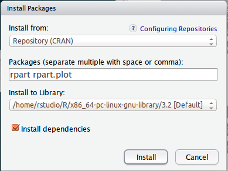

## Programme

R est un langage de programmation et outil d'analyse statistique dont la popularité ne cesse
de croître parmi la communauté des data heroes. 
Au cours de cet atelier, vous allez :

* découvrir les bases du langages R
* apprendre à charger et manipuler des jeux de données
* appliquer des algorithmes de Machine Learning pour la détection de spam
* interpréter et évaluer les modèles générés

### Pré-requis

Vous devez avoir installé les outils suivants:

* R 3.2:
    * [Windows](http://cran.rstudio.com/bin/windows/base/)
    * [MacOS](http://cran.rstudio.com/bin/macosx/)
    * [Linux](http://cran.rstudio.com/bin/linux/)
* RStudio Desktop: http://www.rstudio.com/products/rstudio/download/

Les packages suivants doivent être installés (lancer Rstudio puis menu Tools -> Install packages...):

* rpart
* rpart.plot



Les jeux de données doivent être téléchargés depuis les urls suivantes:

* [Données d'entraînement](https://raw.githubusercontent.com/geraudster/spamdata/master/emails_train.csv)
* [Données de test](https://raw.githubusercontent.com/geraudster/spamdata/master/emails_test.csv)

## Intro R

* R c'est quoi? les origines...
* Présentation RStudio

### R c'est quoi?

**R** est un dialecte de **S**.

S c'est quoi? C'est un environnement pour l'analyse statistique développé en Fortran 
par les laboratoires Bell dès 1976.
Il a été réécrit en C en 1988. 
En 1991, début de l'implémentation de R par l'université d'Aukland, pour pallier au fait que la version de S-PLUS
était propriétaire.

Jusqu'en 2008 S-PLUS devient la propriété de TIBCO.

2015: R en version 3.2

La philosophie de S / R: fournir un environnement interactif pour l'analyse statistique.

### RStudio

[Rstudio](http://www.rstudio.com/) est une société qui publie l'environnement de développement Rstudio (et d'autres services comme ShinyApps, Rpubs...)

Plusieurs versions sont disponibles dont une version *Open Source*.

## Les bases du langage

*A METTRE A JOUR*

R est une grosse calculatrice qui fournit une interface REPL (Read-Eval-Print-Loop).

```{r}
1 + 2
log(5)
sqrt(25)
```

À tout moment, il est possible d'accéder à l'aide en ligne:

```{r}
?log
?sqrt
?`+`
```

### Opérateurs, valeurs, listes, dataframes

Utiliser des scalaires:
```{r}
1 + 2
log(5)
sqrt(25)
```

Affecter un résultat à une variable:
```{r}
resultat <- 1 + 2
resultat
```


Manipuler des vecteurs:

```{r}
c(42,123)
chiffres <- c(1,2,3,4,5,6,7,8,9)
chiffres
chiffres <- 1:9
chiffres
c('a', 'b', 'c')
letters[1:3]
```

Les vecteurs ne contiennent que des données du même type:
```{r}
c(1,2,'toto')
```


Opérations entre scalaires et vecteurs:
```{r}
1:9 + 2
1:9 * 3
```

Opérations entre vecteurs:
```{r}
1:9 * 1:9
1:9 * 2:4
```

Les listes peuvent contenir des types différents:
```{r}
list(1,2,'toto')
maListe <- list(1,2,'toto')
maListe[2]
maListe[[2]]
```

Les Data Frames permettent de stocker des tableaux de données:
```{r}
prenoms <- c('Alice', 'Bob', 'Carole')
sexe <- c('F', 'M', 'F')
ages <- c(24, 30, 23)
monDataFrame <- data.frame(prenoms, sexe, ages)
monDataFrame

monDataFrame[2, 'prenoms']
monDataFrame$prenoms
```

Aide-mémoire pour les indices des data.frames: [ROW, COL] -> ROW is COol


* Structure de contrôle (if, loop..)


## Cas d'utilisation spam filter

À partir d'un jeu de données contenant une liste de e-mails reconnus comme étant soit
spam soit ham, nous allons entraîné plusieurs modèles afin de pouvoir déterminer automatiquement
la nature d'un e-mail.

Dans le jeu de données, les e-mails sont représentés sous forme de vecteurs contenant les termes les plus présents et leurs occurences.

### Récupération et exploration des données

Récupérer les 2 jeux de données depuis les urls suivantes:

* [Données d'entraînement](https://raw.githubusercontent.com/geraudster/spamdata/master/emails_train.csv)
* [Données de test](https://raw.githubusercontent.com/geraudster/spamdata/master/emails_test.csv)

Chargement des données (par l'IHM) ou directement en R:
```{r}
trainSet <- read.csv('emails_train.csv')
testSet <- read.csv('emails_test.csv')

dim(trainSet)
colnames(trainSet)
str(trainSet)
#View(spambase) # ou clic sur spambase dans l'onglet Environment

table(trainSet$spam)
table(testSet$spam)
```

Gestion du label de spam:
```{r}
trainSet$spam <- factor(trainSet$spam, levels = c(0,1), labels = c('ham', 'spam'))
str(trainSet$spam)
table(trainSet$spam)
```

On fait pareil pour le jeu de test:
```{r}
testSet$spam <- factor(testSet$spam, levels = c(0,1), labels = c('ham', 'spam'))
```

### Exploration

Quelques histogrammes:
```{r}
hist(trainSet$enron)
hist(trainSet$like)
hist(trainSet$busi)
```


Une boxplot:
```{r}
boxplot(trainSet$enron ~ trainSet$spam)
boxplot(trainSet$like ~ trainSet$spam)
boxplot(trainSet$busi ~ trainSet$spam)
boxplot(trainSet$pleas ~ trainSet$spam)
boxplot(trainSet$com ~ trainSet$spam)
```


### Modélisation

* Bref rappel des principes de machine learning

*dessin ?*

* Problématique de la classification / présentation de la régression logistique
* Application de l'algo

```{r}
model.logit <- glm(spam ~ ., trainSet, family = 'binomial')
```

* Interprétation du modèle

```{r}
summary(model.logit)
```

* Évaluation du modèle (score, matrice de confusion)

```{r}
train.predictions <- predict(model.logit, newdata = trainSet, type = 'response')
train.confusionMat <- table(trainSet$spam, train.predictions >= 0.5)
train.confusionMat
sum(diag(train.confusionMat) / nrow(trainSet))

test.predictions <- predict(model.logit, newdata = testSet, type = 'response')
test.confusionMat <- table(testSet$spam, test.predictions >= 0.5)
test.confusionMat
sum(diag(test.confusionMat) / nrow(testSet))
```

* Modification du seuil

Avec une valeur de seuil plus pessimiste:
```{r}
train.confusionMat <- table(trainSet$spam, train.predictions >= 0.8)
train.confusionMat
sum(diag(train.confusionMat) / nrow(trainSet))
```

Avec une valeur de seuil plus optimiste:
```{r}
train.confusionMat <- table(trainSet$spam, train.predictions >= 0.2)
train.confusionMat
sum(diag(train.confusionMat) / nrow(trainSet))
```

### Création d'un arbre de décision

Installation des packages par RStudio ou directement en R:
```{r, cache=TRUE, warning=FALSE}
#install.packages('rpart')
#install.packages('rpart.plot')
```

```{r}
library(rpart)
library(rpart.plot)
```

Création du modèle:
```{r}
model.rpart <- rpart(spam ~ ., trainSet)
summary(model.rpart)
```

Interprétation:
```{r}
prp(model.rpart)
#prp(model.rpart, extra = 1)
```

Prédiction sur les données du trainSet:
```{r}
train.predictions2 <- predict(model.rpart, newdata = trainSet)
train.confusionMat2 <- table(trainSet$spam, train.predictions2[,'spam'] >= 0.5)
train.confusionMat2
sum(diag(train.confusionMat2) / nrow(trainSet))
```

Avec une valeur de seuil plus pessimiste:
```{r}
train.confusionMat2 <- table(trainSet$spam, train.predictions2[,'spam'] >= 0.8)
train.confusionMat2
sum(diag(train.confusionMat2) / nrow(trainSet))
```

Avec une valeur de seuil plus optimiste:
```{r}
train.confusionMat2 <- table(trainSet$spam, train.predictions2[,'spam'] >= 0.2)
train.confusionMat2
sum(diag(train.confusionMat2) / nrow(trainSet))
```


Validation du modèle:
```{r}
test.predictions2 <- predict(model.rpart, newdata = testSet)
test.confusionMat2 <- table(testSet$spam, test.predictions2[,'spam'] >= 0.5)
test.confusionMat2
sum(diag(test.confusionMat2) / nrow(testSet))
```


## Bibliographie

* http://www.cs.cmu.edu/~eugene/research/full/detect-scam.pdf
* http://cran.r-project.org/web/views/MachineLearning.html
* http://kooperberg.fhcrc.org/logic/documents/ingophd-logic.pdf
* Lichman, M. (2013). UCI Machine Learning Repository [http://archive.ics.uci.edu/ml]. Irvine, CA: University of California, School of Information and Computer Science. 
* Liste des modèles supportés par le package *caret*: http://topepo.github.io/caret/modelList.html

