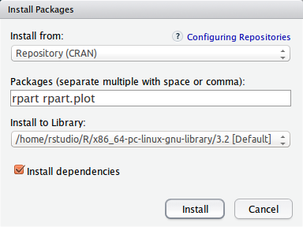

- [Programme](#programme)
    - [Pré-requis](#pr%C3%A9-requis)
- [Intro R](#intro-r)
    - [R c'est quoi?](#r-cest-quoi)
    - [RStudio](#rstudio)
- [Les bases du langage](#les-bases-du-langage)
    - [Opérations arithmétiques de base](#op%C3%A9rations-arithm%C3%A9tiques-de-base)
    - [Fonctions](#fonctions)
    - [Variables](#variables)
    - [Vecteurs](#vecteurs)
    - [Vecteurs - la suite](#vecteurs---la-suite)
    - [Vecteurs - la fin](#vecteurs---la-fin)
    - [Quelques valeurs spéciales](#quelques-valeurs-sp%C3%A9ciales)
    - [Data Frames](#data-frames)
    - [Structures de contrôle (if, loop..)](#structures-de-contr%C3%B4le-if-loop)
- [Cas d'utilisation spam filter](#cas-dutilisation-spam-filter)
    - [Récupération et exploration des données](#r%C3%A9cup%C3%A9ration-et-exploration-des-donn%C3%A9es)
    - [Exploration](#exploration)
    - [Modélisation](#mod%C3%A9lisation)
    - [Application de l'algo](#application-de-lalgo)
    - [Interprétation du modèle](#interpr%C3%A9tation-du-mod%C3%A8le)
    - [Évaluation du modèle (score, matrice de confusion) __slides__](#%C3%A9valuation-du-mod%C3%A8le-score-matrice-de-confusion-__slides__)
    - [Modification du seuil](#modification-du-seuil)
    - [Création d'un arbre de décision](#cr%C3%A9ation-dun-arbre-de-d%C3%A9cision)
- [Pour aller plus loin - les courbes de ROC](#pour-aller-plus-loin---les-courbes-de-roc)
- [Bibliographie](#bibliographie)

## Programme


R est un langage de programmation et outil d'analyse statistique dont la popularité ne cesse
de croître parmi la communauté des data heroes. 
Au cours de cet atelier, nous allons travailler autour du sujet de la détection de spam
et ainsi:

* découvrir les bases du langages R
* apprendre à charger et manipuler des jeux de données
* appliquer des algorithmes de Machine Learning pour la détection de spam
* interpréter et évaluer les modèles générés

### Pré-requis

Vous devez avoir installé les outils suivants:

* R 3.2:
    * [Windows](http://cran.rstudio.com/bin/windows/base/)
    * [MacOS](http://cran.rstudio.com/bin/macosx/)
    * [Linux](http://cran.rstudio.com/bin/linux/)
* RStudio Desktop: http://www.rstudio.com/products/rstudio/download/

Les packages suivants doivent être installés (lancer Rstudio puis menu Tools -> Install packages...):

* rpart
* rpart.plot



Les jeux de données doivent être téléchargés depuis les urls suivantes:

* [Données d'entraînement](https://raw.githubusercontent.com/geraudster/spamdata/master/emails_train.csv)
* [Données de test](https://raw.githubusercontent.com/geraudster/spamdata/master/emails_test.csv)

## Intro R

* R c'est quoi? les origines...
* Présentation RStudio

### R c'est quoi?

**R** est un dialecte de **S**.

S c'est quoi? C'est un environnement pour l'analyse statistique développé en Fortran 
par les laboratoires Bell dès 1976.
Il a été réécrit en C en 1988. 
En 1991, début de l'implémentation de R par l'université d'Aukland, pour pallier au fait que la version de S-PLUS
était propriétaire.

Jusqu'en 2008 S-PLUS devient la propriété de TIBCO.

2015: R en version 3.2

La philosophie de S / R: fournir un environnement interactif pour l'analyse statistique.

### RStudio

[Rstudio](http://www.rstudio.com/) est une société qui publie l'environnement de développement Rstudio (et d'autres services comme ShinyApps, Rpubs...)

Plusieurs versions sont disponibles dont une version *Open Source*.

## Les bases du langage

R est une grosse calculatrice qui fournit une interface REPL (Read-Eval-Print-Loop).

### Opérations arithmétiques de base

```{r}
1 + 2
6 * 7
12 - 30
5 / 13
10 * (5 + 3)
```

Exo:

* Calculer le carré de 5
* Calculer la somme des entiers de 1 à 10
```{r}
# Carré de 5
5 * 5
5 ^ 2

# Somme des 10 premiers entiers
1 + 2 + 3 + 4 + 5 + 6 + 7 + 8 + 9 + 10
10 * (10 + 1 ) / 2
```

### Fonctions

```{r}
log(5)
sqrt(25)
```

À tout moment, il est possible d'accéder à l'aide en ligne:

```{r}
?log
?sqrt
?`+`
```

Les paramètres de fonction:
```{r}
# log en base 10
log(5, base = 10)
```


Exo:

* Calculer la racine carrée de 2
* Calculer la norme d'un vecteur de coordonnées (3,5):
$||\vec{u}|| = \sqrt{x^2 + y^2}$

```{r}
# Racine carrée de 2
sqrt(2)

# Norme du vecteur
sqrt(3^2 + 5^2)
```

### Variables

Affecter un résultat à une variable:
```{r}
resultat <- 1 + 2
resultat
resultat * 2
```

### Vecteurs

Manipuler des vecteurs:

```{r}
c(42,123)
chiffres <- c(1,2,3,4,5,6,7,8,9)
chiffres
chiffres <- 1:9
chiffres
```

Fonctions arithmétiques:
```{r, results='hide'}
length
mean
sum
```

Exo:

* Créer un vecteur contenant les 10 premiers entiers
* Calculer la somme des 10 premiers entiers
* Calculer la moyenne des 10 premiers entiers

```{r}
# Création du vecteur
entiers <- 1:10

# Calcul de la somme
sum(entiers)

# Calcul de la moyenne
mean(entiers)
```

On peut aussi utiliser des chaînes de caractères:
```{r}
prenoms <- c('Alice', 'Bob', 'Carole')
```

Exo:

* Créer un vecteur contenant les éléments 42 et "Hello"

```{r}
c(42, 'Hello')
```

Les vecteurs ne contiennent que des données du même type:
```{r}
c(1,2,'toto')
```

### Vecteurs - la suite

Opérations entre scalaires et vecteurs:
```{r}
1:9 + 2
1:9 * 3
```

Opérations entre vecteurs:
```{r}
1:9 * 1:9
```

Exo:

* Que se passe-t-il si vous exécutez le code `{r} 1:9 * 1:9` ?
* Essayez `{r} 1:9 * 2:4`

### Vecteurs - la fin

Pour sélectionner des éléments:
```{r}
prenoms[2]
prenoms[2:3]
prenoms[c(FALSE, TRUE, TRUE)]
```

Trouver les éléments répondant à une condition:
```{r}
entiers > 5
entiers[entiers > 5]
subset(entiers, entiers > 5)
```

Exo:

* Trouver les entiers pairs (utiliser %% pour le modulo)

```{r}
positionPairs <- (entiers %% 2) == 0
entiers[positionPairs]
```

### Quelques valeurs spéciales

Tester les opérations suivantes:

```{r}
1/0
sqrt(-1)
entiers[20]
```

### Data Frames

Les Data Frames permettent de stocker des tableaux de données, "à la Excel".
**cf. slides**

```{r}
prenoms <- c('Alice', 'Bob', 'Carole')
sexe <- c('F', 'M', 'F')
ages <- c(24, 30, 23)
monDataFrame <- data.frame(prenoms, sexe, ages)
monDataFrame

monDataFrame[2, 'prenoms']
monDataFrame$prenoms
```

Exo:

* Créer le data frame monDF avec les données ci-dessus
* Récupérer l'ensemble des couples (prenom, age)
* Calculer la moyenne d'âge
* Quelle personne est la plus âgée (on utilisera la fonction `which.max`)?

```{r}
monDataFrame[, c('prenoms', 'ages')]
mean(monDataFrame$ages)
monDataFrame[which.max(monDataFrame$ages),]
```

Table de contingence:
```{r}
table(monDataFrame$sexe)
```


Pour modifier le data.frame:
```{r}
monDataFrame$recu <- c(TRUE, FALSE, TRUE)
table(monDataFrame$sexe, monDataFrame$recu)
```

Aide-mémoire pour les indices des data.frames: [ROW, COL] -> ROW is COol

### Structures de contrôle (if, loop..)

Voir 
```{r}
?Control
```

## Cas d'utilisation spam filter

**cf. slide**

À partir d'un jeu de données contenant une liste de e-mails reconnus comme étant soit
spam soit ham, nous allons entraîné plusieurs modèles afin de pouvoir déterminer automatiquement
la nature d'un e-mail.

Dans le jeu de données, les e-mails sont représentés sous forme de vecteurs contenant les termes les plus présents et leurs occurences.

### Récupération et exploration des données

Récupérer les 2 jeux de données depuis les urls suivantes:

* [Données d'entraînement](https://raw.githubusercontent.com/geraudster/spamdata/master/emails_train.csv)
* [Données de test](https://raw.githubusercontent.com/geraudster/spamdata/master/emails_test.csv)

Chargement des données (par l'IHM) ou directement en R:
```{r}
trainSet <- read.csv('emails_train.csv')
testSet <- read.csv('emails_test.csv')

dim(trainSet)
colnames(trainSet)
str(trainSet)
summary(trainSet)
#View(spambase) # ou clic sur spambase dans l'onglet Environment
```

Exo:

* Afficher la répartition spam/ham pour chaque jeu de données (utiliser la fonction _table_)

```{r}
table(trainSet$spam)
table(testSet$spam)
```

Gestion du label de spam:
```{r}
trainSet$spam <- factor(trainSet$spam, levels = c(0,1), labels = c('ham', 'spam'))
str(trainSet$spam)
table(trainSet$spam)
```

On fait pareil pour le jeu de test:
```{r}
testSet$spam <- factor(testSet$spam, levels = c(0,1), labels = c('ham', 'spam'))
```

### Exploration

Nous allons utiliser les fonctionnalités de base pour le dessin de graphiques.

Quelques histogrammes:
```{r}
hist(trainSet$vinc)
hist(trainSet$like)
hist(trainSet$busi)
```


Une boxplot:
```{r}
boxplot(trainSet$vinc ~ trainSet$spam)
title('trainSet$vinc')
boxplot(trainSet$like ~ trainSet$spam, col = 'bisque')
boxplot(trainSet$meet ~ trainSet$spam)
boxplot(trainSet$pleas ~ trainSet$spam, col = c('bisque', 'blue'))
title('Colored boxplot')
boxplot(trainSet$thank ~ trainSet$spam)
```

On voit que certaines variables semblent avoir plus ou moins d'influence sur la caractérisation
de spam/ham. Nous allons voir comment déterminer automatiquement ces règles.

### Modélisation

* Bref rappel des principes de machine learning __cf. slides__

On utilise la fonction logit:

$\sigma(t) = \frac{1}{1 + e^{-t}}$

```{r}
library(ggplot2)
x <- seq(-6, 6, 0.01)
qplot(x, 1 / (1 + exp(-x)), geom = 'line')
```

* Problématique de la classification / présentation de la régression logistique

### Application de l'algo

```{r}
model.logit <- glm(spam ~ vinc + like + meet + pleas + thank, family = 'binomial', trainSet)
summary(model.logit)
```

L'unité est le logit, pour l'interprétation:

```{r}
exp(coef(model.logit))
round(exp(coef(model.logit)), 2)
```


Testons un modèle avec plus de variables:
```{r}
model.logit <- glm(spam ~ ., family = 'binomial', trainSet)
round(exp(coef(model.logit)), 2)
```

### Interprétation du modèle

```{r}
summary(model.logit)
exp(coef(model.logit))
```

### Évaluation du modèle (score, matrice de confusion) __slides__

```{r}
train.predictions <- predict(model.logit, newdata = trainSet, type = 'response')
train.confusionMat <- table(trainSet$spam, train.predictions >= 0.5)
train.confusionMat
(train.confusionMat[1,1] + train.confusionMat[2,2]) / nrow(trainSet)
sum(diag(train.confusionMat)) / nrow(trainSet)
```


Exo:

* Évaluer le modèle sur le jeu de test
* Calculer la spécificité

```{r}
test.predictions <- predict(model.logit, newdata = testSet, type = 'response')
test.confusionMat <- table(testSet$spam, test.predictions >= 0.5)
test.confusionMat
sum(diag(test.confusionMat)) / sum(test.confusionMat)

# Spécificité
test.confusionMat[2,2] / sum(test.confusionMat[2,])
```

Définition d'une fonction pour calculer l'accuracy:
```{r}
accuracy <- function(confusionMatrix) {
  sum(diag(confusionMatrix)) / sum(confusionMatrix)
}

accuracy(test.confusionMat)
```


### Modification du seuil

Exo:

* Évaluer le modèle avec différentes valeurs de seuil (par ex: 0.8, 0.2)

Avec une valeur de seuil plus pessimiste:
```{r}
train.confusionMat <- table(trainSet$spam, train.predictions >= 0.8)
train.confusionMat
sum(diag(train.confusionMat)) / nrow(trainSet)

test.confusionMat <- table(testSet$spam, test.predictions >= 0.8)
test.confusionMat
sum(diag(test.confusionMat)) / nrow(testSet)
```

Avec une valeur de seuil plus optimiste:
```{r}
train.confusionMat <- table(trainSet$spam, train.predictions >= 0.2)
train.confusionMat
sum(diag(train.confusionMat)) / nrow(trainSet)

test.confusionMat <- table(testSet$spam, test.predictions >= 0.2)
test.confusionMat
sum(diag(test.confusionMat)) / nrow(testSet)
```

### Création d'un arbre de décision

Installation des packages par RStudio ou directement en R:
```{r, cache=TRUE, warning=FALSE}
#install.packages('rpart')
#install.packages('rpart.plot')
```

```{r}
library(rpart)
library(rpart.plot)
```

Création du modèle:
```{r}
model.rpart <- rpart(spam ~ ., trainSet)
summary(model.rpart)
```

Exo:

* Entraîner le modèle sur les données du _trainSet_
* Evaluer le modèle sur les données du _trainSet_ puis du _testSet_

Interprétation:
```{r}
prp(model.rpart)
prp(model.rpart, extra = 1)
```

Prédiction sur les données du trainSet:
```{r}
train.predictions2 <- predict(model.rpart, newdata = trainSet)
train.confusionMat2 <- table(trainSet$spam, train.predictions2[,'spam'] >= 0.5)
train.confusionMat2
sum(diag(train.confusionMat2)) / nrow(trainSet)

test.predictions2 <- predict(model.rpart, newdata = testSet)
test.confusionMat2 <- table(testSet$spam, test.predictions2[,'spam'] >= 0.5)
test.confusionMat2
sum(diag(test.confusionMat2)) / nrow(testSet)
```

Exo:

* Évaluer le modèle sur différentes valeurs de seuil (par ex: 0.8, 0.2)

Avec une valeur de seuil plus pessimiste:
```{r}
train.confusionMat2 <- table(trainSet$spam, train.predictions2[,'spam'] >= 0.8)
train.confusionMat2
sum(diag(train.confusionMat2)) / nrow(trainSet)

test.predictions2 <- predict(model.rpart, newdata = testSet)
test.confusionMat2 <- table(testSet$spam, test.predictions2[,'spam'] >= 0.8)
test.confusionMat2
sum(diag(test.confusionMat2)) / nrow(testSet)
```

Avec une valeur de seuil plus optimiste:
```{r}
train.confusionMat2 <- table(trainSet$spam, train.predictions2[,'spam'] >= 0.2)
train.confusionMat2
sum(diag(train.confusionMat2)) / nrow(trainSet)

test.predictions2 <- predict(model.rpart, newdata = testSet)
test.confusionMat2 <- table(testSet$spam, test.predictions2[,'spam'] >= 0.2)
test.confusionMat2
sum(diag(test.confusionMat2)) / nrow(testSet)
```


Validation du modèle:
```{r}
test.predictions2 <- predict(model.rpart, newdata = testSet)
test.confusionMat2 <- table(testSet$spam, test.predictions2[,'spam'] >= 0.5)
test.confusionMat2
sum(diag(test.confusionMat2)) / nrow(testSet)
```

## Pour aller plus loin - les courbes de ROC

Dessinons la courbe ROC pour le modèle de régression logistique: 
```{r}
library(ggplot2)
library(ROCR)
predictions.logit <- prediction(test.predictions, testSet$spam)
perf.logit <- performance(predictions.logit, measure = 'tpr', x.measure = 'fpr')
roc.data <- data.frame(fpr=unlist(perf.logit@x.values),
                       tpr=unlist(perf.logit@y.values),
                       model="GLM")
ggplot(roc.data, aes(x=fpr, ymin=0, ymax=tpr)) +
    geom_ribbon(alpha=0.2) +
    geom_line(aes(y=tpr)) +
    ggtitle('Courbe ROC pour le modèle de régression logistique')
```

Maintenant pour le modèle de l'arbre de décision:

```{r}
predictions.rpart <- prediction(test.predictions2[,'spam'], testSet$spam)
perf.rpart <- performance(predictions.rpart, measure = 'tpr', x.measure = 'fpr')
roc.data <- data.frame(fpr=unlist(perf.rpart@x.values),
                       tpr=unlist(perf.rpart@y.values),
                       model="GLM")
ggplot(roc.data, aes(x=fpr, ymin=0, ymax=tpr)) +
    geom_ribbon(alpha=0.2) +
    geom_line(aes(y=tpr)) +
    ggtitle('Courbe ROC pour le modèle d\'arbre de décision')
```

## Bibliographie

* Intro à R: https://github.com/juba/intro-r
* http://www.cs.cmu.edu/~eugene/research/full/detect-scam.pdf
* http://cran.r-project.org/web/views/MachineLearning.html
* http://kooperberg.fhcrc.org/logic/documents/ingophd-logic.pdf
* Lichman, M. (2013). UCI Machine Learning Repository [http://archive.ics.uci.edu/ml]. Irvine, CA: University of California, School of Information and Computer Science. 
* Liste des modèles supportés par le package *caret*: http://topepo.github.io/caret/modelList.html
