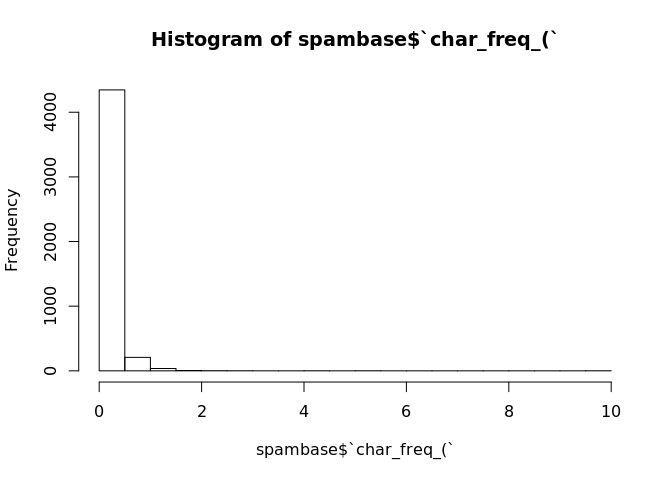

# Sujet Meetup TDS NoBlaBla
Géraud  

## Intro R

* R c'est quoi? les origines...
* Présentation RStudio

### R c'est quoi?

**R** est un dialecte de **S**.

S c'est quoi? C'est un environnement pour l'analyse statistique développé en Fortran 
par les laboratoires Bell dès 1976.
Il a été réécrit en C en 1988. 
En 1991, début de l'implémentation de R par l'université d'Aukland, pour pallier au fait que la version de S-PLUS
était propriétaire.

Jusqu'en 2008 S-PLUS devient la propriété de TIBCO.

2015: R en version 3.2

La philosophie de S / R: fournir un environnement interactif pour l'analyse statistique.

### RStudio

[Rstudio](http://www.rstudio.com/) est une société qui publie l'éditeur Rstudio (et d'autres services comme ShinyApps, Rpubs...)

Plusieurs versions sont disponibles dont une version *Open Source*.

## Les bases du langage

R est une grosse calculatrice qui fournit une interface REPL (Read-Eval-Print-Loop).


```r
1 + 2
```

```
## [1] 3
```

```r
log(5)
```

```
## [1] 1.609438
```

```r
sqrt(25)
```

```
## [1] 5
```

À tout moment, il est possible d'accéder à l'aide en ligne:


```r
?log
?sqrt
?`+`
```

### Opérateurs, valeurs, listes, dataframes

Utiliser des scalaires:

```r
1 + 2
```

```
## [1] 3
```

```r
log(5)
```

```
## [1] 1.609438
```

```r
sqrt(25)
```

```
## [1] 5
```

Affecter un résultat à une variable:

```r
result <- 1 + 2
result
```

```
## [1] 3
```


Manipuler des vecteurs:


```r
c(1,2,3,4,5,6,7,8,9)
```

```
## [1] 1 2 3 4 5 6 7 8 9
```

```r
c(1:9)
```

```
## [1] 1 2 3 4 5 6 7 8 9
```

```r
c('a', 'b', 'c')
```

```
## [1] "a" "b" "c"
```

```r
letters[1:3]
```

```
## [1] "a" "b" "c"
```

Les vecteurs ne contiennent que des données du même type:

```r
c(1,2,'toto')
```

```
## [1] "1"    "2"    "toto"
```


Opérations entre scalaires et vecteurs:

```r
c(1:9) + 2
```

```
## [1]  3  4  5  6  7  8  9 10 11
```

```r
c(1:9) * 3
```

```
## [1]  3  6  9 12 15 18 21 24 27
```

Opérations entre vecteurs:

```r
c(1:9)*c(1:9)
```

```
## [1]  1  4  9 16 25 36 49 64 81
```

```r
c(1:9)*c(2:4)
```

```
## [1]  2  6 12  8 15 24 14 24 36
```

Les listes peuvent contenir des types différents:

```r
list(1,2,'toto')
```

```
## [[1]]
## [1] 1
## 
## [[2]]
## [1] 2
## 
## [[3]]
## [1] "toto"
```

```r
maListe <- list(1,2,'toto')
maListe[2]
```

```
## [[1]]
## [1] 2
```

```r
maListe[[2]]
```

```
## [1] 2
```

Les Data Frames permettent de stocker des tableaux de données:

```r
prenoms <- c('Alice', 'Bob', 'Carole')
emails <- c('alice@example.com', 'bob@example.com', 'carole@example.com')
ages <- c(24, 30, 23)
monDataFrame <- data.frame(prenoms, emails, ages)
monDataFrame
```

```
##   prenoms             emails ages
## 1   Alice  alice@example.com   24
## 2     Bob    bob@example.com   30
## 3  Carole carole@example.com   23
```

```r
monDataFrame[2, 'prenoms']
```

```
## [1] Bob
## Levels: Alice Bob Carole
```

```r
monDataFrame$prenoms
```

```
## [1] Alice  Bob    Carole
## Levels: Alice Bob Carole
```

Aide-mémoire pour les indices des data.frames: [ROW, COL] -> ROW is COol


* Structure de contrôle (if, loop..)


## Cas d'utilisation spam filter

### Récupération et exploration des données

* Récupération du jeu de données (https://archive.ics.uci.edu/ml/datasets/Spambase)
* Un peu de stats descriptives, quelques plots
* *Réduction de dimensions ?*

Récupérer les données depuis l'url distante:

```r
url <- 'https://archive.ics.uci.edu/ml/machine-learning-databases/spambase/spambase.zip'
dest <- './data'
dir.create(dest)
```

```
## Warning in dir.create(dest): './data' already exists
```

```r
download.file(url,
              paste(dest, 'spambase.zip', sep='/'), method = 'curl')
```

Ensuite on décompresse l'archive:

```r
unzip(paste(dest, 'spambase.zip', sep='/'), exdir=dest)
```

Regardons les fichiers créés:

```r
list.files(dest)
```

```
## [1] "spambase.data"          "spambase.DOCUMENTATION"
## [3] "spambase.names"         "spambase.zip"
```

Chargement des données:

```r
spambase <- read.csv('data/spambase.data')

dim(spambase)
```

```
## [1] 4600   58
```

```r
colnames(spambase)
```

```
##  [1] "X0"      "X0.64"   "X0.64.1" "X0.1"    "X0.32"   "X0.2"    "X0.3"   
##  [8] "X0.4"    "X0.5"    "X0.6"    "X0.7"    "X0.64.2" "X0.8"    "X0.9"   
## [15] "X0.10"   "X0.32.1" "X0.11"   "X1.29"   "X1.93"   "X0.12"   "X0.96"  
## [22] "X0.13"   "X0.14"   "X0.15"   "X0.16"   "X0.17"   "X0.18"   "X0.19"  
## [29] "X0.20"   "X0.21"   "X0.22"   "X0.23"   "X0.24"   "X0.25"   "X0.26"  
## [36] "X0.27"   "X0.28"   "X0.29"   "X0.30"   "X0.31"   "X0.33"   "X0.34"  
## [43] "X0.35"   "X0.36"   "X0.37"   "X0.38"   "X0.39"   "X0.40"   "X0.41"  
## [50] "X0.42"   "X0.43"   "X0.778"  "X0.44"   "X0.45"   "X3.756"  "X61"    
## [57] "X278"    "X1"
```

```r
head(spambase, 5)
```

```
##     X0 X0.64 X0.64.1 X0.1 X0.32 X0.2 X0.3 X0.4 X0.5 X0.6 X0.7 X0.64.2 X0.8
## 1 0.21  0.28    0.50    0  0.14 0.28 0.21 0.07 0.00 0.94 0.21    0.79 0.65
## 2 0.06  0.00    0.71    0  1.23 0.19 0.19 0.12 0.64 0.25 0.38    0.45 0.12
## 3 0.00  0.00    0.00    0  0.63 0.00 0.31 0.63 0.31 0.63 0.31    0.31 0.31
## 4 0.00  0.00    0.00    0  0.63 0.00 0.31 0.63 0.31 0.63 0.31    0.31 0.31
## 5 0.00  0.00    0.00    0  1.85 0.00 0.00 1.85 0.00 0.00 0.00    0.00 0.00
##   X0.9 X0.10 X0.32.1 X0.11 X1.29 X1.93 X0.12 X0.96 X0.13 X0.14 X0.15 X0.16
## 1 0.21  0.14    0.14  0.07  0.28  3.47  0.00  1.59     0  0.43  0.43     0
## 2 0.00  1.75    0.06  0.06  1.03  1.36  0.32  0.51     0  1.16  0.06     0
## 3 0.00  0.00    0.31  0.00  0.00  3.18  0.00  0.31     0  0.00  0.00     0
## 4 0.00  0.00    0.31  0.00  0.00  3.18  0.00  0.31     0  0.00  0.00     0
## 5 0.00  0.00    0.00  0.00  0.00  0.00  0.00  0.00     0  0.00  0.00     0
##   X0.17 X0.18 X0.19 X0.20 X0.21 X0.22 X0.23 X0.24 X0.25 X0.26 X0.27 X0.28
## 1     0     0     0     0     0     0     0     0     0     0     0  0.07
## 2     0     0     0     0     0     0     0     0     0     0     0  0.00
## 3     0     0     0     0     0     0     0     0     0     0     0  0.00
## 4     0     0     0     0     0     0     0     0     0     0     0  0.00
## 5     0     0     0     0     0     0     0     0     0     0     0  0.00
##   X0.29 X0.30 X0.31 X0.33 X0.34 X0.35 X0.36 X0.37 X0.38 X0.39 X0.40 X0.41
## 1     0     0  0.00     0     0  0.00     0  0.00  0.00     0     0  0.00
## 2     0     0  0.06     0     0  0.12     0  0.06  0.06     0     0  0.01
## 3     0     0  0.00     0     0  0.00     0  0.00  0.00     0     0  0.00
## 4     0     0  0.00     0     0  0.00     0  0.00  0.00     0     0  0.00
## 5     0     0  0.00     0     0  0.00     0  0.00  0.00     0     0  0.00
##   X0.42 X0.43 X0.778 X0.44 X0.45 X3.756 X61 X278 X1
## 1 0.132     0  0.372 0.180 0.048  5.114 101 1028  1
## 2 0.143     0  0.276 0.184 0.010  9.821 485 2259  1
## 3 0.137     0  0.137 0.000 0.000  3.537  40  191  1
## 4 0.135     0  0.135 0.000 0.000  3.537  40  191  1
## 5 0.223     0  0.000 0.000 0.000  3.000  15   54  1
```

```r
#View(spambase) # ou clic sur spambase dans l'onglet Environment

table(spambase[,58])
```

```
## 
##    0    1 
## 2788 1812
```

Chargement des entêtes:

```r
spambase.names <- readLines('data/spambase.names')
spambase.names <- sub(':.*$', '', spambase.names[34:length(spambase.names)])
spambase.names [length(spambase.names) + 1] <- 'spam'

spambase.names
```

```
##  [1] "word_freq_make"             "word_freq_address"         
##  [3] "word_freq_all"              "word_freq_3d"              
##  [5] "word_freq_our"              "word_freq_over"            
##  [7] "word_freq_remove"           "word_freq_internet"        
##  [9] "word_freq_order"            "word_freq_mail"            
## [11] "word_freq_receive"          "word_freq_will"            
## [13] "word_freq_people"           "word_freq_report"          
## [15] "word_freq_addresses"        "word_freq_free"            
## [17] "word_freq_business"         "word_freq_email"           
## [19] "word_freq_you"              "word_freq_credit"          
## [21] "word_freq_your"             "word_freq_font"            
## [23] "word_freq_000"              "word_freq_money"           
## [25] "word_freq_hp"               "word_freq_hpl"             
## [27] "word_freq_george"           "word_freq_650"             
## [29] "word_freq_lab"              "word_freq_labs"            
## [31] "word_freq_telnet"           "word_freq_857"             
## [33] "word_freq_data"             "word_freq_415"             
## [35] "word_freq_85"               "word_freq_technology"      
## [37] "word_freq_1999"             "word_freq_parts"           
## [39] "word_freq_pm"               "word_freq_direct"          
## [41] "word_freq_cs"               "word_freq_meeting"         
## [43] "word_freq_original"         "word_freq_project"         
## [45] "word_freq_re"               "word_freq_edu"             
## [47] "word_freq_table"            "word_freq_conference"      
## [49] "char_freq_;"                "char_freq_("               
## [51] "char_freq_["                "char_freq_!"               
## [53] "char_freq_$"                "char_freq_#"               
## [55] "capital_run_length_average" "capital_run_length_longest"
## [57] "capital_run_length_total"   "spam"
```

Renommage des colonnes du data.frame:

```r
colnames(spambase) <- spambase.names

str(spambase)
```

```
## 'data.frame':	4600 obs. of  58 variables:
##  $ word_freq_make            : num  0.21 0.06 0 0 0 0 0 0.15 0.06 0 ...
##  $ word_freq_address         : num  0.28 0 0 0 0 0 0 0 0.12 0 ...
##  $ word_freq_all             : num  0.5 0.71 0 0 0 0 0 0.46 0.77 0 ...
##  $ word_freq_3d              : num  0 0 0 0 0 0 0 0 0 0 ...
##  $ word_freq_our             : num  0.14 1.23 0.63 0.63 1.85 1.92 1.88 0.61 0.19 0 ...
##  $ word_freq_over            : num  0.28 0.19 0 0 0 0 0 0 0.32 0 ...
##  $ word_freq_remove          : num  0.21 0.19 0.31 0.31 0 0 0 0.3 0.38 0.96 ...
##  $ word_freq_internet        : num  0.07 0.12 0.63 0.63 1.85 0 1.88 0 0 0 ...
##  $ word_freq_order           : num  0 0.64 0.31 0.31 0 0 0 0.92 0.06 0 ...
##  $ word_freq_mail            : num  0.94 0.25 0.63 0.63 0 0.64 0 0.76 0 1.92 ...
##  $ word_freq_receive         : num  0.21 0.38 0.31 0.31 0 0.96 0 0.76 0 0.96 ...
##  $ word_freq_will            : num  0.79 0.45 0.31 0.31 0 1.28 0 0.92 0.64 0 ...
##  $ word_freq_people          : num  0.65 0.12 0.31 0.31 0 0 0 0 0.25 0 ...
##  $ word_freq_report          : num  0.21 0 0 0 0 0 0 0 0 0 ...
##  $ word_freq_addresses       : num  0.14 1.75 0 0 0 0 0 0 0.12 0 ...
##  $ word_freq_free            : num  0.14 0.06 0.31 0.31 0 0.96 0 0 0 0 ...
##  $ word_freq_business        : num  0.07 0.06 0 0 0 0 0 0 0 0 ...
##  $ word_freq_email           : num  0.28 1.03 0 0 0 0.32 0 0.15 0.12 0.96 ...
##  $ word_freq_you             : num  3.47 1.36 3.18 3.18 0 3.85 0 1.23 1.67 3.84 ...
##  $ word_freq_credit          : num  0 0.32 0 0 0 0 0 3.53 0.06 0 ...
##  $ word_freq_your            : num  1.59 0.51 0.31 0.31 0 0.64 0 2 0.71 0.96 ...
##  $ word_freq_font            : num  0 0 0 0 0 0 0 0 0 0 ...
##  $ word_freq_000             : num  0.43 1.16 0 0 0 0 0 0 0.19 0 ...
##  $ word_freq_money           : num  0.43 0.06 0 0 0 0 0 0.15 0 0 ...
##  $ word_freq_hp              : num  0 0 0 0 0 0 0 0 0 0 ...
##  $ word_freq_hpl             : num  0 0 0 0 0 0 0 0 0 0 ...
##  $ word_freq_george          : num  0 0 0 0 0 0 0 0 0 0 ...
##  $ word_freq_650             : num  0 0 0 0 0 0 0 0 0 0 ...
##  $ word_freq_lab             : num  0 0 0 0 0 0 0 0 0 0 ...
##  $ word_freq_labs            : num  0 0 0 0 0 0 0 0 0 0 ...
##  $ word_freq_telnet          : num  0 0 0 0 0 0 0 0 0 0 ...
##  $ word_freq_857             : num  0 0 0 0 0 0 0 0 0 0 ...
##  $ word_freq_data            : num  0 0 0 0 0 0 0 0.15 0 0 ...
##  $ word_freq_415             : num  0 0 0 0 0 0 0 0 0 0 ...
##  $ word_freq_85              : num  0 0 0 0 0 0 0 0 0 0 ...
##  $ word_freq_technology      : num  0 0 0 0 0 0 0 0 0 0 ...
##  $ word_freq_1999            : num  0.07 0 0 0 0 0 0 0 0 0 ...
##  $ word_freq_parts           : num  0 0 0 0 0 0 0 0 0 0 ...
##  $ word_freq_pm              : num  0 0 0 0 0 0 0 0 0 0 ...
##  $ word_freq_direct          : num  0 0.06 0 0 0 0 0 0 0 0.96 ...
##  $ word_freq_cs              : num  0 0 0 0 0 0 0 0 0 0 ...
##  $ word_freq_meeting         : num  0 0 0 0 0 0 0 0 0 0 ...
##  $ word_freq_original        : num  0 0.12 0 0 0 0 0 0.3 0 0 ...
##  $ word_freq_project         : num  0 0 0 0 0 0 0 0 0.06 0 ...
##  $ word_freq_re              : num  0 0.06 0 0 0 0 0 0 0 0 ...
##  $ word_freq_edu             : num  0 0.06 0 0 0 0 0 0 0 0 ...
##  $ word_freq_table           : num  0 0 0 0 0 0 0 0 0 0 ...
##  $ word_freq_conference      : num  0 0 0 0 0 0 0 0 0 0 ...
##  $ char_freq_;               : num  0 0.01 0 0 0 0 0 0 0.04 0 ...
##  $ char_freq_(               : num  0.132 0.143 0.137 0.135 0.223 0.054 0.206 0.271 0.03 0 ...
##  $ char_freq_[               : num  0 0 0 0 0 0 0 0 0 0 ...
##  $ char_freq_!               : num  0.372 0.276 0.137 0.135 0 0.164 0 0.181 0.244 0.462 ...
##  $ char_freq_$               : num  0.18 0.184 0 0 0 0.054 0 0.203 0.081 0 ...
##  $ char_freq_#               : num  0.048 0.01 0 0 0 0 0 0.022 0 0 ...
##  $ capital_run_length_average: num  5.11 9.82 3.54 3.54 3 ...
##  $ capital_run_length_longest: int  101 485 40 40 15 4 11 445 43 6 ...
##  $ capital_run_length_total  : int  1028 2259 191 191 54 112 49 1257 749 21 ...
##  $ spam                      : int  1 1 1 1 1 1 1 1 1 1 ...
```

```r
class(spambase$spam)
```

```
## [1] "integer"
```

Gestion du label de spam:

```r
spambase$spam <- factor(spambase$spam, c(0,1), labels = c('nospam', 'spam'))
str(spambase$spam)
```

```
##  Factor w/ 2 levels "nospam","spam": 2 2 2 2 2 2 2 2 2 2 ...
```

```r
table(spambase$spam)
```

```
## 
## nospam   spam 
##   2788   1812
```

### Exploration

Quelques histogrammes:

```r
hist(spambase$word_freq_people)
```

 

```r
hist(spambase$`char_freq_(`)
```

 

Un histogramme plus avancé:

```r
hist(spambase$word_freq_order[spambase$spam == 'nospam'], col = 'blue', breaks = 20)
hist(spambase$word_freq_order[spambase$spam == 'spam'], col = 'red', add = T, breaks = 20)
```

 

On voit qu'il y a beaucoup de valeurs à 0 ou proche de 0 (**à voir si on normalise**).


### Modélisation

* Bref rappel des principes de machine learning

*dessin ?*

* Préparation train set / test set


```r
set.seed(123)
spambase.train.idx <- sample.int(nrow(spambase), nrow(spambase) * 0.8)
spambase.train <- spambase[spambase.train.idx,]
spambase.test <- spambase[-spambase.train.idx,]

dim(spambase.train)
```

```
## [1] 3680   58
```

```r
dim(spambase.test)
```

```
## [1] 920  58
```

```r
prop.table(table(spambase.train$spam))
```

```
## 
##   nospam     spam 
## 0.605163 0.394837
```

```r
prop.table(table(spambase.test$spam))
```

```
## 
##    nospam      spam 
## 0.6097826 0.3902174
```

* Problématique de la classification / présentation de la régression logistique
* Application de l'algo


```r
# model1 <- glm(spam ~ word_freq_free + word_freq_internet, data = spambase.train, family = "binomial")
# summary(model1)
model1 <- glm(spam ~ ., data = spambase.train, family = "binomial")
```

```
## Warning: glm.fit: fitted probabilities numerically 0 or 1 occurred
```

```r
summary(model1)
```

```
## 
## Call:
## glm(formula = spam ~ ., family = "binomial", data = spambase.train)
## 
## Deviance Residuals: 
##     Min       1Q   Median       3Q      Max  
## -4.3804  -0.1984   0.0000   0.0972   5.5182  
## 
## Coefficients:
##                              Estimate Std. Error z value Pr(>|z|)    
## (Intercept)                -1.705e+00  1.625e-01 -10.497  < 2e-16 ***
## word_freq_make             -3.928e-01  2.631e-01  -1.493 0.135464    
## word_freq_address          -1.365e-01  7.666e-02  -1.780 0.075037 .  
## word_freq_all               1.369e-01  1.289e-01   1.062 0.288217    
## word_freq_3d                1.752e+00  1.662e+00   1.054 0.291818    
## word_freq_our               6.085e-01  1.194e-01   5.097 3.46e-07 ***
## word_freq_over              1.057e+00  3.051e-01   3.465 0.000530 ***
## word_freq_remove            2.748e+00  4.517e-01   6.084 1.17e-09 ***
## word_freq_internet          5.945e-01  1.799e-01   3.305 0.000949 ***
## word_freq_order             1.052e+00  3.315e-01   3.173 0.001509 ** 
## word_freq_mail              8.261e-02  7.344e-02   1.125 0.260651    
## word_freq_receive          -2.321e-01  3.348e-01  -0.693 0.488084    
## word_freq_will             -1.287e-01  8.453e-02  -1.523 0.127750    
## word_freq_people           -3.778e-01  2.888e-01  -1.308 0.190815    
## word_freq_report            2.053e-01  1.411e-01   1.456 0.145514    
## word_freq_addresses         1.510e+00  9.221e-01   1.637 0.101613    
## word_freq_free              8.767e-01  1.467e-01   5.976 2.28e-09 ***
## word_freq_business          9.721e-01  2.549e-01   3.813 0.000137 ***
## word_freq_email             1.160e-01  1.277e-01   0.909 0.363366    
## word_freq_you               8.452e-02  4.174e-02   2.025 0.042867 *  
## word_freq_credit            1.350e+00  6.373e-01   2.118 0.034209 *  
## word_freq_your              2.546e-01  6.257e-02   4.069 4.72e-05 ***
## word_freq_font              1.616e-01  1.895e-01   0.853 0.393658    
## word_freq_000               2.219e+00  5.051e-01   4.394 1.11e-05 ***
## word_freq_money             1.793e+00  4.337e-01   4.134 3.56e-05 ***
## word_freq_hp               -1.995e+00  3.681e-01  -5.419 6.01e-08 ***
## word_freq_hpl              -8.557e-01  4.943e-01  -1.731 0.083433 .  
## word_freq_george           -1.275e+01  2.546e+00  -5.007 5.53e-07 ***
## word_freq_650               4.360e-01  1.959e-01   2.226 0.026044 *  
## word_freq_lab              -2.119e+00  1.557e+00  -1.361 0.173534    
## word_freq_labs             -1.567e-01  2.961e-01  -0.529 0.596575    
## word_freq_telnet           -9.631e-02  3.425e-01  -0.281 0.778556    
## word_freq_857               1.639e+00  3.827e+00   0.428 0.668492    
## word_freq_data             -8.732e-01  4.067e-01  -2.147 0.031810 *  
## word_freq_415              -1.334e+01  3.989e+00  -3.345 0.000823 ***
## word_freq_85               -1.640e+00  8.575e-01  -1.913 0.055781 .  
## word_freq_technology        9.718e-01  3.320e-01   2.928 0.003417 ** 
## word_freq_1999              1.198e-01  1.737e-01   0.690 0.490287    
## word_freq_parts             6.201e-01  1.569e+00   0.395 0.692728    
## word_freq_pm               -9.469e-01  4.447e-01  -2.129 0.033244 *  
## word_freq_direct           -3.439e-01  3.831e-01  -0.898 0.369373    
## word_freq_cs               -4.423e+01  3.177e+01  -1.392 0.163881    
## word_freq_meeting          -3.219e+00  1.176e+00  -2.738 0.006182 ** 
## word_freq_original         -1.260e+00  8.505e-01  -1.482 0.138466    
## word_freq_project          -1.583e+00  5.727e-01  -2.764 0.005706 ** 
## word_freq_re               -8.567e-01  1.878e-01  -4.561 5.08e-06 ***
## word_freq_edu              -1.291e+00  2.787e-01  -4.630 3.66e-06 ***
## word_freq_table            -2.473e+00  2.256e+00  -1.096 0.272926    
## word_freq_conference       -4.139e+00  1.814e+00  -2.281 0.022556 *  
## `char_freq_;`              -1.102e+00  4.578e-01  -2.408 0.016056 *  
## `char_freq_(`              -1.404e-01  2.524e-01  -0.556 0.577904    
## `char_freq_[`              -4.708e-01  7.690e-01  -0.612 0.540378    
## `char_freq_!`               5.044e-01  1.158e-01   4.357 1.32e-05 ***
## `char_freq_$`               4.376e+00  7.139e-01   6.130 8.81e-10 ***
## `char_freq_#`               2.508e+00  1.216e+00   2.062 0.039227 *  
## capital_run_length_average  1.726e-02  2.149e-02   0.803 0.421961    
## capital_run_length_longest  9.052e-03  2.874e-03   3.150 0.001632 ** 
## capital_run_length_total    8.126e-04  2.493e-04   3.260 0.001116 ** 
## ---
## Signif. codes:  0 '***' 0.001 '**' 0.01 '*' 0.05 '.' 0.1 ' ' 1
## 
## (Dispersion parameter for binomial family taken to be 1)
## 
##     Null deviance: 4937.5  on 3679  degrees of freedom
## Residual deviance: 1393.6  on 3622  degrees of freedom
## AIC: 1509.6
## 
## Number of Fisher Scoring iterations: 13
```

* Interprétation du modèle

*TODO?*

* Évaluation du modèle (score, matrice de confusion)


```r
predictions1 <- predict(model1, newdata = spambase.test, type = "response")

# x <- seq(0,10,0.01)
# y <- predict(model1, newdata = x, type = "response")
# lines(spambase.test$word_freq_our, predictions1)

predictions1 <- sapply(predictions1, function (x) { if (x>0.5) 'spam' else 'nospam'})

table(spambase.test$spam, predictions1)
```

```
##         predictions1
##          nospam spam
##   nospam    532   29
##   spam       40  319
```

```r
prop.table(table(spambase.test$spam, predictions1),1)
```

```
##         predictions1
##             nospam      spam
##   nospam 0.9483066 0.0516934
##   spam   0.1114206 0.8885794
```

```r
mean(predictions1 == spambase.test$spam)
```

```
## [1] 0.925
```

### Utilisation de caret


```
## Loading required package: lattice
## Loading required package: ggplot2
```


```r
model2 <- train(spam ~ ., data = spambase.train, method = 'glm')
```

```
## Warning: glm.fit: fitted probabilities numerically 0 or 1 occurred
```

```
## Warning: glm.fit: fitted probabilities numerically 0 or 1 occurred
```

```
## Warning: glm.fit: fitted probabilities numerically 0 or 1 occurred
```

```
## Warning: glm.fit: fitted probabilities numerically 0 or 1 occurred
```

```
## Warning: glm.fit: fitted probabilities numerically 0 or 1 occurred
```

```
## Warning: glm.fit: fitted probabilities numerically 0 or 1 occurred
```

```
## Warning: glm.fit: fitted probabilities numerically 0 or 1 occurred
```

```
## Warning: glm.fit: fitted probabilities numerically 0 or 1 occurred
```

```
## Warning: glm.fit: fitted probabilities numerically 0 or 1 occurred
```

```
## Warning: glm.fit: fitted probabilities numerically 0 or 1 occurred
```

```
## Warning: glm.fit: fitted probabilities numerically 0 or 1 occurred
```

```
## Warning: glm.fit: fitted probabilities numerically 0 or 1 occurred
```

```
## Warning: glm.fit: fitted probabilities numerically 0 or 1 occurred
```

```
## Warning: glm.fit: fitted probabilities numerically 0 or 1 occurred
```

```
## Warning: glm.fit: fitted probabilities numerically 0 or 1 occurred
```

```
## Warning: glm.fit: fitted probabilities numerically 0 or 1 occurred
```

```
## Warning: glm.fit: algorithm did not converge
```

```
## Warning: glm.fit: fitted probabilities numerically 0 or 1 occurred
```

```
## Warning: glm.fit: fitted probabilities numerically 0 or 1 occurred
```

```
## Warning: glm.fit: fitted probabilities numerically 0 or 1 occurred
```

```
## Warning: glm.fit: fitted probabilities numerically 0 or 1 occurred
```

```
## Warning: glm.fit: fitted probabilities numerically 0 or 1 occurred
```

```
## Warning: glm.fit: fitted probabilities numerically 0 or 1 occurred
```

```
## Warning: glm.fit: fitted probabilities numerically 0 or 1 occurred
```

```
## Warning: glm.fit: fitted probabilities numerically 0 or 1 occurred
```

```
## Warning: glm.fit: fitted probabilities numerically 0 or 1 occurred
```

```
## Warning: glm.fit: fitted probabilities numerically 0 or 1 occurred
```

```r
predictions2 <- predict(model2, newdata = spambase.test)
confusionMatrix(predictions2, spambase.test$spam)
```

```
## Confusion Matrix and Statistics
## 
##           Reference
## Prediction nospam spam
##     nospam    532   40
##     spam       29  319
##                                          
##                Accuracy : 0.925          
##                  95% CI : (0.906, 0.9412)
##     No Information Rate : 0.6098         
##     P-Value [Acc > NIR] : <2e-16         
##                                          
##                   Kappa : 0.8415         
##  Mcnemar's Test P-Value : 0.2286         
##                                          
##             Sensitivity : 0.9483         
##             Specificity : 0.8886         
##          Pos Pred Value : 0.9301         
##          Neg Pred Value : 0.9167         
##              Prevalence : 0.6098         
##          Detection Rate : 0.5783         
##    Detection Prevalence : 0.6217         
##       Balanced Accuracy : 0.9184         
##                                          
##        'Positive' Class : nospam         
## 
```


Pour aller plus loin, introduction au package [caret](http://topepo.github.io/caret/index.html) et tests avec différents algorithmes de machine learning (arbres de décision, random forest, gbm, *Naive Bayes*...)

## Bibliographie

* http://www.cs.cmu.edu/~eugene/research/full/detect-scam.pdf
* http://cran.r-project.org/web/views/MachineLearning.html
* http://kooperberg.fhcrc.org/logic/documents/ingophd-logic.pdf
* Lichman, M. (2013). UCI Machine Learning Repository [http://archive.ics.uci.edu/ml]. Irvine, CA: University of California, School of Information and Computer Science. 
