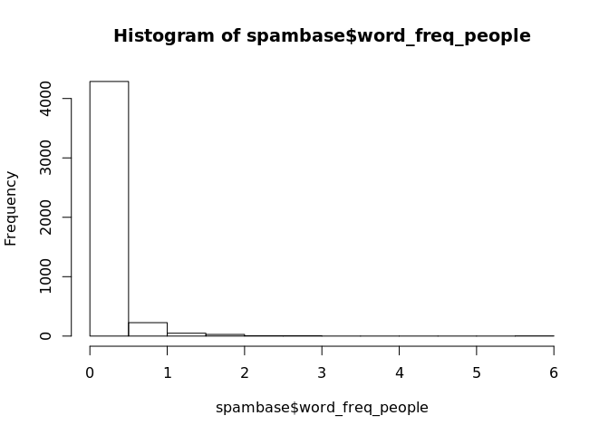
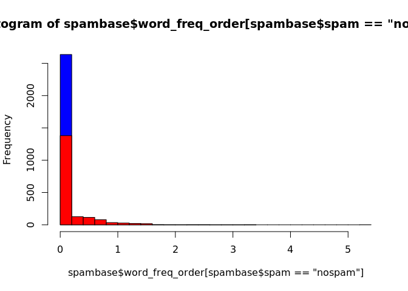
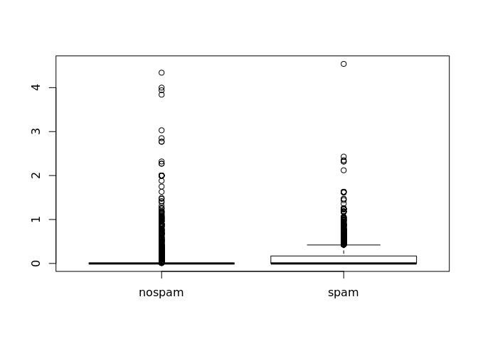
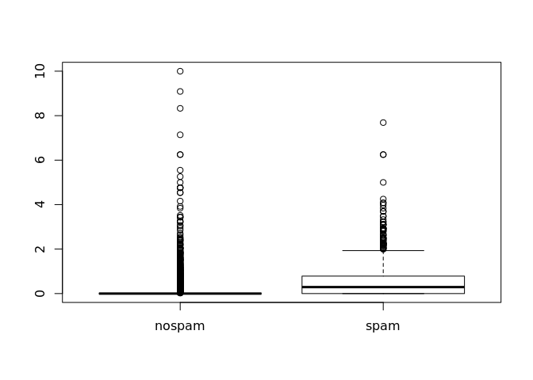
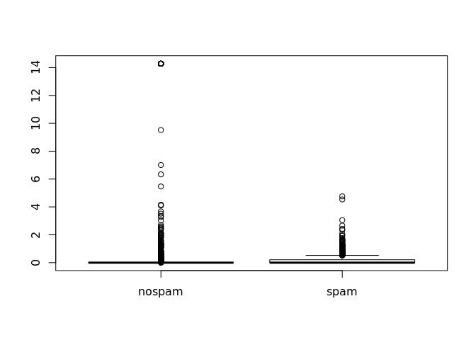
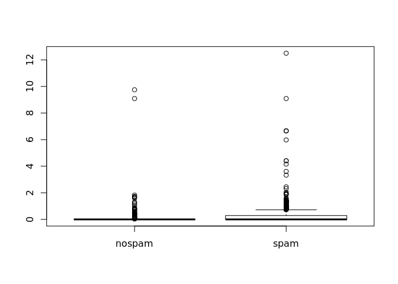
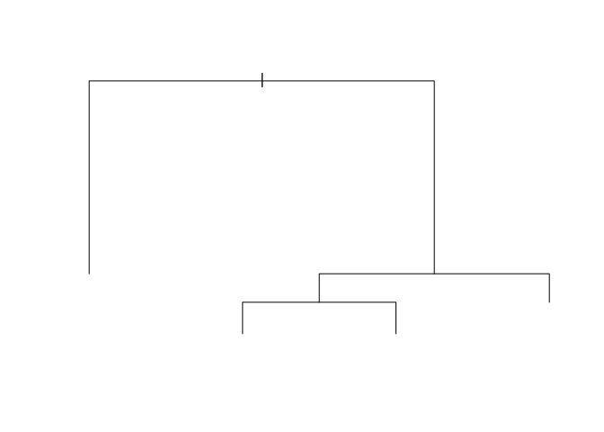

# Sujet Meetup TDS NoBlaBla
Géraud  

## Intro R

* R c'est quoi? les origines...
* Présentation RStudio

### R c'est quoi?

**R** est un dialecte de **S**.

S c'est quoi? C'est un environnement pour l'analyse statistique développé en Fortran 
par les laboratoires Bell dès 1976.
Il a été réécrit en C en 1988. 
En 1991, début de l'implémentation de R par l'université d'Aukland, pour pallier au fait que la version de S-PLUS
était propriétaire.

Jusqu'en 2008 S-PLUS devient la propriété de TIBCO.

2015: R en version 3.2

La philosophie de S / R: fournir un environnement interactif pour l'analyse statistique.

### RStudio

[Rstudio](http://www.rstudio.com/) est une société qui publie l'éditeur Rstudio (et d'autres services comme ShinyApps, Rpubs...)

Plusieurs versions sont disponibles dont une version *Open Source*.

## Les bases du langage

R est une grosse calculatrice qui fournit une interface REPL (Read-Eval-Print-Loop).


```r
1 + 2
```

```
## [1] 3
```

```r
log(5)
```

```
## [1] 1.609438
```

```r
sqrt(25)
```

```
## [1] 5
```

À tout moment, il est possible d'accéder à l'aide en ligne:


```r
?log
?sqrt
?`+`
```

### Opérateurs, valeurs, listes, dataframes

Utiliser des scalaires:

```r
1 + 2
```

```
## [1] 3
```

```r
log(5)
```

```
## [1] 1.609438
```

```r
sqrt(25)
```

```
## [1] 5
```

Affecter un résultat à une variable:

```r
result <- 1 + 2
result
```

```
## [1] 3
```


Manipuler des vecteurs:


```r
c(1,2,3,4,5,6,7,8,9)
```

```
## [1] 1 2 3 4 5 6 7 8 9
```

```r
1:9
```

```
## [1] 1 2 3 4 5 6 7 8 9
```

```r
c('a', 'b', 'c')
```

```
## [1] "a" "b" "c"
```

```r
letters[1:3]
```

```
## [1] "a" "b" "c"
```

Les vecteurs ne contiennent que des données du même type:

```r
c(1,2,'toto')
```

```
## [1] "1"    "2"    "toto"
```


Opérations entre scalaires et vecteurs:

```r
1:9 + 2
```

```
## [1]  3  4  5  6  7  8  9 10 11
```

```r
1:9 * 3
```

```
## [1]  3  6  9 12 15 18 21 24 27
```

Opérations entre vecteurs:

```r
1:9 * 1:9
```

```
## [1]  1  4  9 16 25 36 49 64 81
```

```r
1:9 * 2:4
```

```
## [1]  2  6 12  8 15 24 14 24 36
```

Les listes peuvent contenir des types différents:

```r
list(1,2,'toto')
```

```
## [[1]]
## [1] 1
## 
## [[2]]
## [1] 2
## 
## [[3]]
## [1] "toto"
```

```r
maListe <- list(1,2,'toto')
maListe[2]
```

```
## [[1]]
## [1] 2
```

```r
maListe[[2]]
```

```
## [1] 2
```

Les Data Frames permettent de stocker des tableaux de données:

```r
prenoms <- c('Alice', 'Bob', 'Carole')
emails <- c('alice@example.com', 'bob@example.com', 'carole@example.com')
ages <- c(24, 30, 23)
monDataFrame <- data.frame(prenoms, emails, ages)
monDataFrame
```

```
##   prenoms             emails ages
## 1   Alice  alice@example.com   24
## 2     Bob    bob@example.com   30
## 3  Carole carole@example.com   23
```

```r
monDataFrame[2, 'prenoms']
```

```
## [1] Bob
## Levels: Alice Bob Carole
```

```r
monDataFrame$prenoms
```

```
## [1] Alice  Bob    Carole
## Levels: Alice Bob Carole
```

Aide-mémoire pour les indices des data.frames: [ROW, COL] -> ROW is COol


* Structure de contrôle (if, loop..)


## Cas d'utilisation spam filter

### Récupération et exploration des données

* Récupération du jeu de données (https://archive.ics.uci.edu/ml/datasets/Spambase)
* Un peu de stats descriptives, quelques plots
* *Réduction de dimensions ?*

Récupérer les données depuis l'url distante:

```r
url <- 'https://archive.ics.uci.edu/ml/machine-learning-databases/spambase/spambase.zip'
dest <- './data'
dir.create(dest)
```

```
## Warning in dir.create(dest): './data' already exists
```

```r
download.file(url,
              paste(dest, 'spambase.zip', sep='/'), method = 'curl')
```

Ensuite on décompresse l'archive:

```r
unzip(paste(dest, 'spambase.zip', sep='/'), exdir=dest)
```

Regardons les fichiers créés:

```r
list.files(dest)
```

```
## [1] "spambase.data"          "spambase.DOCUMENTATION"
## [3] "spambase.names"         "spambase.zip"
```

Chargement des données:

```r
spambase <- read.csv('data/spambase.data')

dim(spambase)
```

```
## [1] 4600   58
```

```r
colnames(spambase)
```

```
##  [1] "X0"      "X0.64"   "X0.64.1" "X0.1"    "X0.32"   "X0.2"    "X0.3"   
##  [8] "X0.4"    "X0.5"    "X0.6"    "X0.7"    "X0.64.2" "X0.8"    "X0.9"   
## [15] "X0.10"   "X0.32.1" "X0.11"   "X1.29"   "X1.93"   "X0.12"   "X0.96"  
## [22] "X0.13"   "X0.14"   "X0.15"   "X0.16"   "X0.17"   "X0.18"   "X0.19"  
## [29] "X0.20"   "X0.21"   "X0.22"   "X0.23"   "X0.24"   "X0.25"   "X0.26"  
## [36] "X0.27"   "X0.28"   "X0.29"   "X0.30"   "X0.31"   "X0.33"   "X0.34"  
## [43] "X0.35"   "X0.36"   "X0.37"   "X0.38"   "X0.39"   "X0.40"   "X0.41"  
## [50] "X0.42"   "X0.43"   "X0.778"  "X0.44"   "X0.45"   "X3.756"  "X61"    
## [57] "X278"    "X1"
```

```r
head(spambase, 5)
```

```
##     X0 X0.64 X0.64.1 X0.1 X0.32 X0.2 X0.3 X0.4 X0.5 X0.6 X0.7 X0.64.2 X0.8
## 1 0.21  0.28    0.50    0  0.14 0.28 0.21 0.07 0.00 0.94 0.21    0.79 0.65
## 2 0.06  0.00    0.71    0  1.23 0.19 0.19 0.12 0.64 0.25 0.38    0.45 0.12
## 3 0.00  0.00    0.00    0  0.63 0.00 0.31 0.63 0.31 0.63 0.31    0.31 0.31
## 4 0.00  0.00    0.00    0  0.63 0.00 0.31 0.63 0.31 0.63 0.31    0.31 0.31
## 5 0.00  0.00    0.00    0  1.85 0.00 0.00 1.85 0.00 0.00 0.00    0.00 0.00
##   X0.9 X0.10 X0.32.1 X0.11 X1.29 X1.93 X0.12 X0.96 X0.13 X0.14 X0.15 X0.16
## 1 0.21  0.14    0.14  0.07  0.28  3.47  0.00  1.59     0  0.43  0.43     0
## 2 0.00  1.75    0.06  0.06  1.03  1.36  0.32  0.51     0  1.16  0.06     0
## 3 0.00  0.00    0.31  0.00  0.00  3.18  0.00  0.31     0  0.00  0.00     0
## 4 0.00  0.00    0.31  0.00  0.00  3.18  0.00  0.31     0  0.00  0.00     0
## 5 0.00  0.00    0.00  0.00  0.00  0.00  0.00  0.00     0  0.00  0.00     0
##   X0.17 X0.18 X0.19 X0.20 X0.21 X0.22 X0.23 X0.24 X0.25 X0.26 X0.27 X0.28
## 1     0     0     0     0     0     0     0     0     0     0     0  0.07
## 2     0     0     0     0     0     0     0     0     0     0     0  0.00
## 3     0     0     0     0     0     0     0     0     0     0     0  0.00
## 4     0     0     0     0     0     0     0     0     0     0     0  0.00
## 5     0     0     0     0     0     0     0     0     0     0     0  0.00
##   X0.29 X0.30 X0.31 X0.33 X0.34 X0.35 X0.36 X0.37 X0.38 X0.39 X0.40 X0.41
## 1     0     0  0.00     0     0  0.00     0  0.00  0.00     0     0  0.00
## 2     0     0  0.06     0     0  0.12     0  0.06  0.06     0     0  0.01
## 3     0     0  0.00     0     0  0.00     0  0.00  0.00     0     0  0.00
## 4     0     0  0.00     0     0  0.00     0  0.00  0.00     0     0  0.00
## 5     0     0  0.00     0     0  0.00     0  0.00  0.00     0     0  0.00
##   X0.42 X0.43 X0.778 X0.44 X0.45 X3.756 X61 X278 X1
## 1 0.132     0  0.372 0.180 0.048  5.114 101 1028  1
## 2 0.143     0  0.276 0.184 0.010  9.821 485 2259  1
## 3 0.137     0  0.137 0.000 0.000  3.537  40  191  1
## 4 0.135     0  0.135 0.000 0.000  3.537  40  191  1
## 5 0.223     0  0.000 0.000 0.000  3.000  15   54  1
```

```r
#View(spambase) # ou clic sur spambase dans l'onglet Environment

table(spambase[,58])
```

```
## 
##    0    1 
## 2788 1812
```

Chargement des entêtes:

```r
spambase.names <- readLines('data/spambase.names')
spambase.names <- sub(':.*$', '', spambase.names[34:length(spambase.names)])
spambase.names [length(spambase.names) + 1] <- 'spam'

spambase.names
```

```
##  [1] "word_freq_make"             "word_freq_address"         
##  [3] "word_freq_all"              "word_freq_3d"              
##  [5] "word_freq_our"              "word_freq_over"            
##  [7] "word_freq_remove"           "word_freq_internet"        
##  [9] "word_freq_order"            "word_freq_mail"            
## [11] "word_freq_receive"          "word_freq_will"            
## [13] "word_freq_people"           "word_freq_report"          
## [15] "word_freq_addresses"        "word_freq_free"            
## [17] "word_freq_business"         "word_freq_email"           
## [19] "word_freq_you"              "word_freq_credit"          
## [21] "word_freq_your"             "word_freq_font"            
## [23] "word_freq_000"              "word_freq_money"           
## [25] "word_freq_hp"               "word_freq_hpl"             
## [27] "word_freq_george"           "word_freq_650"             
## [29] "word_freq_lab"              "word_freq_labs"            
## [31] "word_freq_telnet"           "word_freq_857"             
## [33] "word_freq_data"             "word_freq_415"             
## [35] "word_freq_85"               "word_freq_technology"      
## [37] "word_freq_1999"             "word_freq_parts"           
## [39] "word_freq_pm"               "word_freq_direct"          
## [41] "word_freq_cs"               "word_freq_meeting"         
## [43] "word_freq_original"         "word_freq_project"         
## [45] "word_freq_re"               "word_freq_edu"             
## [47] "word_freq_table"            "word_freq_conference"      
## [49] "char_freq_;"                "char_freq_("               
## [51] "char_freq_["                "char_freq_!"               
## [53] "char_freq_$"                "char_freq_#"               
## [55] "capital_run_length_average" "capital_run_length_longest"
## [57] "capital_run_length_total"   "spam"
```

Renommage des colonnes du data.frame:

```r
colnames(spambase) <- spambase.names
spambase <- data.frame(spambase)
str(spambase)
```

```
## 'data.frame':	4600 obs. of  58 variables:
##  $ word_freq_make            : num  0.21 0.06 0 0 0 0 0 0.15 0.06 0 ...
##  $ word_freq_address         : num  0.28 0 0 0 0 0 0 0 0.12 0 ...
##  $ word_freq_all             : num  0.5 0.71 0 0 0 0 0 0.46 0.77 0 ...
##  $ word_freq_3d              : num  0 0 0 0 0 0 0 0 0 0 ...
##  $ word_freq_our             : num  0.14 1.23 0.63 0.63 1.85 1.92 1.88 0.61 0.19 0 ...
##  $ word_freq_over            : num  0.28 0.19 0 0 0 0 0 0 0.32 0 ...
##  $ word_freq_remove          : num  0.21 0.19 0.31 0.31 0 0 0 0.3 0.38 0.96 ...
##  $ word_freq_internet        : num  0.07 0.12 0.63 0.63 1.85 0 1.88 0 0 0 ...
##  $ word_freq_order           : num  0 0.64 0.31 0.31 0 0 0 0.92 0.06 0 ...
##  $ word_freq_mail            : num  0.94 0.25 0.63 0.63 0 0.64 0 0.76 0 1.92 ...
##  $ word_freq_receive         : num  0.21 0.38 0.31 0.31 0 0.96 0 0.76 0 0.96 ...
##  $ word_freq_will            : num  0.79 0.45 0.31 0.31 0 1.28 0 0.92 0.64 0 ...
##  $ word_freq_people          : num  0.65 0.12 0.31 0.31 0 0 0 0 0.25 0 ...
##  $ word_freq_report          : num  0.21 0 0 0 0 0 0 0 0 0 ...
##  $ word_freq_addresses       : num  0.14 1.75 0 0 0 0 0 0 0.12 0 ...
##  $ word_freq_free            : num  0.14 0.06 0.31 0.31 0 0.96 0 0 0 0 ...
##  $ word_freq_business        : num  0.07 0.06 0 0 0 0 0 0 0 0 ...
##  $ word_freq_email           : num  0.28 1.03 0 0 0 0.32 0 0.15 0.12 0.96 ...
##  $ word_freq_you             : num  3.47 1.36 3.18 3.18 0 3.85 0 1.23 1.67 3.84 ...
##  $ word_freq_credit          : num  0 0.32 0 0 0 0 0 3.53 0.06 0 ...
##  $ word_freq_your            : num  1.59 0.51 0.31 0.31 0 0.64 0 2 0.71 0.96 ...
##  $ word_freq_font            : num  0 0 0 0 0 0 0 0 0 0 ...
##  $ word_freq_000             : num  0.43 1.16 0 0 0 0 0 0 0.19 0 ...
##  $ word_freq_money           : num  0.43 0.06 0 0 0 0 0 0.15 0 0 ...
##  $ word_freq_hp              : num  0 0 0 0 0 0 0 0 0 0 ...
##  $ word_freq_hpl             : num  0 0 0 0 0 0 0 0 0 0 ...
##  $ word_freq_george          : num  0 0 0 0 0 0 0 0 0 0 ...
##  $ word_freq_650             : num  0 0 0 0 0 0 0 0 0 0 ...
##  $ word_freq_lab             : num  0 0 0 0 0 0 0 0 0 0 ...
##  $ word_freq_labs            : num  0 0 0 0 0 0 0 0 0 0 ...
##  $ word_freq_telnet          : num  0 0 0 0 0 0 0 0 0 0 ...
##  $ word_freq_857             : num  0 0 0 0 0 0 0 0 0 0 ...
##  $ word_freq_data            : num  0 0 0 0 0 0 0 0.15 0 0 ...
##  $ word_freq_415             : num  0 0 0 0 0 0 0 0 0 0 ...
##  $ word_freq_85              : num  0 0 0 0 0 0 0 0 0 0 ...
##  $ word_freq_technology      : num  0 0 0 0 0 0 0 0 0 0 ...
##  $ word_freq_1999            : num  0.07 0 0 0 0 0 0 0 0 0 ...
##  $ word_freq_parts           : num  0 0 0 0 0 0 0 0 0 0 ...
##  $ word_freq_pm              : num  0 0 0 0 0 0 0 0 0 0 ...
##  $ word_freq_direct          : num  0 0.06 0 0 0 0 0 0 0 0.96 ...
##  $ word_freq_cs              : num  0 0 0 0 0 0 0 0 0 0 ...
##  $ word_freq_meeting         : num  0 0 0 0 0 0 0 0 0 0 ...
##  $ word_freq_original        : num  0 0.12 0 0 0 0 0 0.3 0 0 ...
##  $ word_freq_project         : num  0 0 0 0 0 0 0 0 0.06 0 ...
##  $ word_freq_re              : num  0 0.06 0 0 0 0 0 0 0 0 ...
##  $ word_freq_edu             : num  0 0.06 0 0 0 0 0 0 0 0 ...
##  $ word_freq_table           : num  0 0 0 0 0 0 0 0 0 0 ...
##  $ word_freq_conference      : num  0 0 0 0 0 0 0 0 0 0 ...
##  $ char_freq_.               : num  0 0.01 0 0 0 0 0 0 0.04 0 ...
##  $ char_freq_..1             : num  0.132 0.143 0.137 0.135 0.223 0.054 0.206 0.271 0.03 0 ...
##  $ char_freq_..2             : num  0 0 0 0 0 0 0 0 0 0 ...
##  $ char_freq_..3             : num  0.372 0.276 0.137 0.135 0 0.164 0 0.181 0.244 0.462 ...
##  $ char_freq_..4             : num  0.18 0.184 0 0 0 0.054 0 0.203 0.081 0 ...
##  $ char_freq_..5             : num  0.048 0.01 0 0 0 0 0 0.022 0 0 ...
##  $ capital_run_length_average: num  5.11 9.82 3.54 3.54 3 ...
##  $ capital_run_length_longest: int  101 485 40 40 15 4 11 445 43 6 ...
##  $ capital_run_length_total  : int  1028 2259 191 191 54 112 49 1257 749 21 ...
##  $ spam                      : int  1 1 1 1 1 1 1 1 1 1 ...
```

```r
class(spambase$spam)
```

```
## [1] "integer"
```

Gestion du label de spam:

```r
spambase$spam <- factor(spambase$spam, levels = c(0,1), labels = c('nospam', 'spam'))
str(spambase$spam)
```

```
##  Factor w/ 2 levels "nospam","spam": 2 2 2 2 2 2 2 2 2 2 ...
```

```r
table(spambase$spam)
```

```
## 
## nospam   spam 
##   2788   1812
```

### Exploration

Quelques histogrammes:

```r
hist(spambase$word_freq_people)
```

 

Un histogramme plus avancé:

```r
hist(spambase$word_freq_order[spambase$spam == 'nospam'], col = 'blue', breaks = 20)
hist(spambase$word_freq_order[spambase$spam == 'spam'], col = 'red', add = T, breaks = 20)
```

 

Une boxplot:

```r
boxplot(spambase$word_freq_make ~ spambase$spam)
```

 

```r
boxplot(spambase$word_freq_our ~ spambase$spam)
```

 

```r
boxplot(spambase$word_freq_address ~ spambase$spam)
```

 

```r
boxplot(spambase$word_freq_money ~ spambase$spam)
```

 

On voit qu'il y a beaucoup de valeurs à 0 ou proche de 0 (**à voir si on normalise**).


### Modélisation

* Bref rappel des principes de machine learning

*dessin ?*

* Préparation train set / test set


```r
set.seed(123)
spambase.train.idx <- sample.int(nrow(spambase), nrow(spambase) * 0.7)
spambase.train <- spambase[spambase.train.idx,]
spambase.test <- spambase[-spambase.train.idx,]

dim(spambase.train)
```

```
## [1] 3220   58
```

```r
dim(spambase.test)
```

```
## [1] 1380   58
```

```r
prop.table(table(spambase.train$spam))
```

```
## 
##    nospam      spam 
## 0.6099379 0.3900621
```

```r
prop.table(table(spambase.test$spam))
```

```
## 
##    nospam      spam 
## 0.5971014 0.4028986
```

* Problématique de la classification / présentation de la régression logistique
* Application de l'algo


```r
# model1 <- glm(spam ~ word_freq_free + word_freq_internet, data = spambase.train, family = "binomial")
# summary(model1)
model1 <- glm(spam ~ ., data = spambase.train, family = "binomial")
```

```
## Warning: glm.fit: fitted probabilities numerically 0 or 1 occurred
```

```r
summary(model1)
```

```
## 
## Call:
## glm(formula = spam ~ ., family = "binomial", data = spambase.train)
## 
## Deviance Residuals: 
##     Min       1Q   Median       3Q      Max  
## -4.0792  -0.1884   0.0000   0.0966   4.9236  
## 
## Coefficients:
##                              Estimate Std. Error z value Pr(>|z|)    
## (Intercept)                -1.679e+00  1.729e-01  -9.707  < 2e-16 ***
## word_freq_make             -4.493e-01  2.857e-01  -1.573 0.115824    
## word_freq_address          -1.619e-01  1.007e-01  -1.607 0.108002    
## word_freq_all               1.627e-01  1.344e-01   1.210 0.226139    
## word_freq_3d                1.854e+00  1.719e+00   1.078 0.280834    
## word_freq_our               5.416e-01  1.207e-01   4.487 7.21e-06 ***
## word_freq_over              1.044e+00  3.100e-01   3.368 0.000757 ***
## word_freq_remove            2.643e+00  4.718e-01   5.603 2.11e-08 ***
## word_freq_internet          5.720e-01  1.814e-01   3.153 0.001619 ** 
## word_freq_order             1.006e+00  3.457e-01   2.908 0.003635 ** 
## word_freq_mail              6.434e-02  7.577e-02   0.849 0.395810    
## word_freq_receive          -4.206e-01  3.604e-01  -1.167 0.243241    
## word_freq_will             -7.750e-02  8.641e-02  -0.897 0.369777    
## word_freq_people           -4.705e-01  3.167e-01  -1.485 0.137421    
## word_freq_report            2.328e-01  1.523e-01   1.529 0.126363    
## word_freq_addresses         1.402e+00  9.075e-01   1.545 0.122324    
## word_freq_free              1.066e+00  1.697e-01   6.285 3.29e-10 ***
## word_freq_business          9.888e-01  2.746e-01   3.601 0.000317 ***
## word_freq_email             1.324e-01  1.492e-01   0.888 0.374697    
## word_freq_you               9.230e-02  4.401e-02   2.097 0.035977 *  
## word_freq_credit            1.239e+00  6.367e-01   1.946 0.051598 .  
## word_freq_your              2.472e-01  6.595e-02   3.747 0.000179 ***
## word_freq_font              2.032e-01  2.111e-01   0.963 0.335709    
## word_freq_000               2.237e+00  4.931e-01   4.536 5.73e-06 ***
## word_freq_money             1.541e+00  4.441e-01   3.469 0.000523 ***
## word_freq_hp               -2.058e+00  4.636e-01  -4.440 9.00e-06 ***
## word_freq_hpl              -1.273e+00  6.138e-01  -2.074 0.038125 *  
## word_freq_george           -1.022e+01  2.503e+00  -4.085 4.41e-05 ***
## word_freq_650               4.417e-01  1.998e-01   2.211 0.027047 *  
## word_freq_lab              -1.906e+00  1.452e+00  -1.313 0.189306    
## word_freq_labs             -1.310e-01  3.026e-01  -0.433 0.665136    
## word_freq_telnet           -8.963e+01  3.808e+03  -0.024 0.981223    
## word_freq_857               7.376e-01  4.169e+00   0.177 0.859589    
## word_freq_data             -7.575e-01  3.903e-01  -1.941 0.052258 .  
## word_freq_415              -1.329e+01  4.062e+00  -3.272 0.001066 ** 
## word_freq_85               -1.833e+00  9.316e-01  -1.967 0.049177 *  
## word_freq_technology        9.546e-01  3.783e-01   2.524 0.011617 *  
## word_freq_1999              5.820e-02  1.863e-01   0.312 0.754723    
## word_freq_parts             8.029e-01  1.627e+00   0.494 0.621610    
## word_freq_pm               -9.565e-01  4.496e-01  -2.127 0.033385 *  
## word_freq_direct           -3.653e-01  3.973e-01  -0.919 0.357911    
## word_freq_cs               -4.195e+01  3.207e+01  -1.308 0.190766    
## word_freq_meeting          -2.969e+00  1.147e+00  -2.588 0.009648 ** 
## word_freq_original         -1.141e+00  8.868e-01  -1.287 0.198167    
## word_freq_project          -1.453e+00  5.683e-01  -2.556 0.010584 *  
## word_freq_re               -8.585e-01  1.974e-01  -4.348 1.37e-05 ***
## word_freq_edu              -1.206e+00  2.771e-01  -4.352 1.35e-05 ***
## word_freq_table            -3.025e+00  2.634e+00  -1.149 0.250761    
## word_freq_conference       -3.851e+00  1.712e+00  -2.249 0.024524 *  
## char_freq_.                -1.228e+00  5.132e-01  -2.393 0.016722 *  
## char_freq_..1              -1.741e-01  2.661e-01  -0.654 0.513048    
## char_freq_..2              -6.924e-01  9.716e-01  -0.713 0.476070    
## char_freq_..3               4.532e-01  1.209e-01   3.749 0.000177 ***
## char_freq_..4               4.049e+00  7.317e-01   5.533 3.15e-08 ***
## char_freq_..5               2.603e+00  1.216e+00   2.140 0.032386 *  
## capital_run_length_average -4.769e-03  2.176e-02  -0.219 0.826554    
## capital_run_length_longest  1.043e-02  3.058e-03   3.411 0.000648 ***
## capital_run_length_total    6.950e-04  2.505e-04   2.774 0.005533 ** 
## ---
## Signif. codes:  0 '***' 0.001 '**' 0.01 '*' 0.05 '.' 0.1 ' ' 1
## 
## (Dispersion parameter for binomial family taken to be 1)
## 
##     Null deviance: 4306.9  on 3219  degrees of freedom
## Residual deviance: 1210.4  on 3162  degrees of freedom
## AIC: 1326.4
## 
## Number of Fisher Scoring iterations: 21
```

* Interprétation du modèle

*TODO?*

* Évaluation du modèle (score, matrice de confusion)


```r
predictions1 <- predict(model1, newdata = spambase.test, type = "response")

# x <- seq(0,10,0.01)
# y <- predict(model1, newdata = x, type = "response")
# lines(spambase.test$word_freq_our, predictions1)

predictions1 <- sapply(predictions1, function (x) { if (x>0.5) 'spam' else 'nospam'})

table(spambase.test$spam, predictions1)
```

```
##         predictions1
##          nospam spam
##   nospam    785   39
##   spam       62  494
```

```r
prop.table(table(spambase.test$spam, predictions1),1)
```

```
##         predictions1
##             nospam      spam
##   nospam 0.9526699 0.0473301
##   spam   0.1115108 0.8884892
```

```r
mean(predictions1 == spambase.test$spam)
```

```
## [1] 0.9268116
```

### Utilisation de caret


```
## Loading required package: lattice
## Loading required package: ggplot2
```


```r
model2 <- train(spam ~ ., data = spambase.train, method = 'glm')
```

```
## Warning: glm.fit: fitted probabilities numerically 0 or 1 occurred
```

```
## Warning: glm.fit: fitted probabilities numerically 0 or 1 occurred
```

```
## Warning: glm.fit: fitted probabilities numerically 0 or 1 occurred
```

```
## Warning: glm.fit: fitted probabilities numerically 0 or 1 occurred
```

```
## Warning: glm.fit: fitted probabilities numerically 0 or 1 occurred
```

```
## Warning: glm.fit: fitted probabilities numerically 0 or 1 occurred
```

```
## Warning: glm.fit: fitted probabilities numerically 0 or 1 occurred
```

```
## Warning: glm.fit: fitted probabilities numerically 0 or 1 occurred
```

```
## Warning: glm.fit: fitted probabilities numerically 0 or 1 occurred
```

```
## Warning: glm.fit: fitted probabilities numerically 0 or 1 occurred
```

```
## Warning: glm.fit: fitted probabilities numerically 0 or 1 occurred
```

```
## Warning: glm.fit: fitted probabilities numerically 0 or 1 occurred
```

```
## Warning: glm.fit: fitted probabilities numerically 0 or 1 occurred
```

```
## Warning: glm.fit: fitted probabilities numerically 0 or 1 occurred
```

```
## Warning: glm.fit: fitted probabilities numerically 0 or 1 occurred
```

```
## Warning: glm.fit: fitted probabilities numerically 0 or 1 occurred
```

```
## Warning: glm.fit: fitted probabilities numerically 0 or 1 occurred
```

```
## Warning: glm.fit: fitted probabilities numerically 0 or 1 occurred
```

```
## Warning: glm.fit: fitted probabilities numerically 0 or 1 occurred
```

```
## Warning: glm.fit: fitted probabilities numerically 0 or 1 occurred
```

```
## Warning: glm.fit: fitted probabilities numerically 0 or 1 occurred
```

```
## Warning: glm.fit: fitted probabilities numerically 0 or 1 occurred
```

```
## Warning: glm.fit: fitted probabilities numerically 0 or 1 occurred
```

```
## Warning: glm.fit: fitted probabilities numerically 0 or 1 occurred
```

```
## Warning: glm.fit: fitted probabilities numerically 0 or 1 occurred
```

```
## Warning: glm.fit: fitted probabilities numerically 0 or 1 occurred
```

```r
predictions2 <- predict(model2, newdata = spambase.test)
confusionMatrix(predictions2, spambase.test$spam)
```

```
## Confusion Matrix and Statistics
## 
##           Reference
## Prediction nospam spam
##     nospam    785   62
##     spam       39  494
##                                         
##                Accuracy : 0.9268        
##                  95% CI : (0.9118, 0.94)
##     No Information Rate : 0.5971        
##     P-Value [Acc > NIR] : < 2e-16       
##                                         
##                   Kappa : 0.8469        
##  Mcnemar's Test P-Value : 0.02859       
##                                         
##             Sensitivity : 0.9527        
##             Specificity : 0.8885        
##          Pos Pred Value : 0.9268        
##          Neg Pred Value : 0.9268        
##              Prevalence : 0.5971        
##          Detection Rate : 0.5688        
##    Detection Prevalence : 0.6138        
##       Balanced Accuracy : 0.9206        
##                                         
##        'Positive' Class : nospam        
## 
```

Avec un arbre de décision:

```r
model3 <- train(spam ~ ., data = spambase.train, method = 'rpart')
```

```
## Loading required package: rpart
```

```r
predictions3 <- predict(model3, newdata = spambase.test)
confusionMatrix(predictions3, spambase.test$spam)
```

```
## Confusion Matrix and Statistics
## 
##           Reference
## Prediction nospam spam
##     nospam    785  202
##     spam       39  354
##                                          
##                Accuracy : 0.8254         
##                  95% CI : (0.8043, 0.845)
##     No Information Rate : 0.5971         
##     P-Value [Acc > NIR] : < 2.2e-16      
##                                          
##                   Kappa : 0.6189         
##  Mcnemar's Test P-Value : < 2.2e-16      
##                                          
##             Sensitivity : 0.9527         
##             Specificity : 0.6367         
##          Pos Pred Value : 0.7953         
##          Neg Pred Value : 0.9008         
##              Prevalence : 0.5971         
##          Detection Rate : 0.5688         
##    Detection Prevalence : 0.7152         
##       Balanced Accuracy : 0.7947         
##                                          
##        'Positive' Class : nospam         
## 
```

```r
plot(model3$finalModel)
```

 

Une random forest:

```r
model4 <- train(spam ~ ., data = spambase.train, method = 'rf')
```

```
## Loading required package: randomForest
## randomForest 4.6-10
## Type rfNews() to see new features/changes/bug fixes.
```

```r
predictions4 <- predict(model4, newdata = spambase.test)
confusionMatrix(predictions4, spambase.test$spam)
```

```
## Confusion Matrix and Statistics
## 
##           Reference
## Prediction nospam spam
##     nospam    805   58
##     spam       19  498
##                                           
##                Accuracy : 0.9442          
##                  95% CI : (0.9308, 0.9557)
##     No Information Rate : 0.5971          
##     P-Value [Acc > NIR] : < 2.2e-16       
##                                           
##                   Kappa : 0.8827          
##  Mcnemar's Test P-Value : 1.488e-05       
##                                           
##             Sensitivity : 0.9769          
##             Specificity : 0.8957          
##          Pos Pred Value : 0.9328          
##          Neg Pred Value : 0.9632          
##              Prevalence : 0.5971          
##          Detection Rate : 0.5833          
##    Detection Prevalence : 0.6254          
##       Balanced Accuracy : 0.9363          
##                                           
##        'Positive' Class : nospam          
## 
```

Naive Bayes:

```r
# model5 <- train(spam ~ ., data = spambase.train, method = 'nb')
# predictions5 <- predict(model5, newdata = spambase.test)
# confusionMatrix(predictions5, spambase.test$spam)
```


Pour aller plus loin, introduction au package [caret](http://topepo.github.io/caret/index.html) et tests avec différents algorithmes de machine learning (arbres de décision, random forest, gbm, *Naive Bayes*...)

## Bibliographie

* http://www.cs.cmu.edu/~eugene/research/full/detect-scam.pdf
* http://cran.r-project.org/web/views/MachineLearning.html
* http://kooperberg.fhcrc.org/logic/documents/ingophd-logic.pdf
* Lichman, M. (2013). UCI Machine Learning Repository [http://archive.ics.uci.edu/ml]. Irvine, CA: University of California, School of Information and Computer Science. 
* Liste des modèles supportés par le package *caret*: http://topepo.github.io/caret/modelList.html

