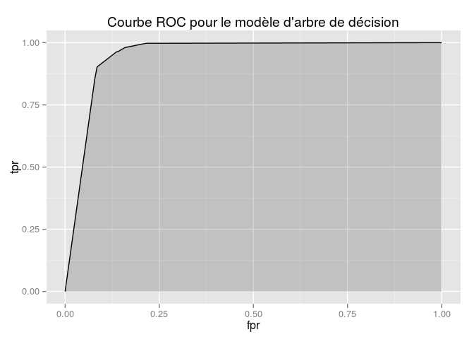

# Sujet Meetup TDS NoBlaBla
Géraud  


## Bases du langage

### Data Frames

Les Data Frames permettent de stocker des tableaux de données, "à la Excel".
**cf. slides**


```r
> prenoms <- c('Alice', 'Bob', 'Carole')
> sexe <- c('F', 'M', 'F')
> ages <- c(24, 30, 23)
> monDataFrame <- data.frame(prenoms, sexe, ages)
> monDataFrame
```

```
##   prenoms sexe ages
## 1   Alice    F   24
## 2     Bob    M   30
## 3  Carole    F   23
```

```r
> monDataFrame[2, 'prenoms']
```

```
## [1] Bob
## Levels: Alice Bob Carole
```

```r
> monDataFrame$prenoms
```

```
## [1] Alice  Bob    Carole
## Levels: Alice Bob Carole
```

Exo:

* Créer le data frame monDF avec les données ci-dessus
* Récupérer l'ensemble des couples (prenom, age)
* Calculer la moyenne d'âge
* Quelle personne est la plus âgée (on utilisera la fonction `which.max`)?


```r
> monDataFrame[, c('prenoms', 'ages')]
```

```
##   prenoms ages
## 1   Alice   24
## 2     Bob   30
## 3  Carole   23
```

```r
> mean(monDataFrame$ages)
```

```
## [1] 25.66667
```

```r
> monDataFrame[which.max(monDataFrame$ages),]
```

```
##   prenoms sexe ages
## 2     Bob    M   30
```

Table de contingence:

```r
> table(monDataFrame$sexe)
```

```
## 
## F M 
## 2 1
```


Pour modifier le data.frame:

```r
> monDataFrame$recu <- c(TRUE, FALSE, TRUE)
> table(monDataFrame$sexe, monDataFrame$recu)
```

```
##    
##     FALSE TRUE
##   F     0    2
##   M     1    0
```

Aide-mémoire pour les indices des data.frames: [ROW, COL] -> ROW is COol

### Structures de contrôle (if, loop..)

Voir 

```r
> ?Control
```

## Cas d'utilisation spam filter

**cf. slide**

À partir d'un jeu de données contenant une liste de e-mails reconnus comme étant soit
spam soit ham, nous allons entraîné plusieurs modèles afin de pouvoir déterminer automatiquement
la nature d'un e-mail.

Dans le jeu de données, les e-mails sont représentés sous forme de vecteurs contenant les termes les plus présents et leurs occurences.

### Récupération et exploration des données

Récupérer les 2 jeux de données depuis les urls suivantes:

* [Données d'entraînement](https://raw.githubusercontent.com/geraudster/spamdata/master/emails_train.csv)
* [Données de test](https://raw.githubusercontent.com/geraudster/spamdata/master/emails_test.csv)

Chargement des données (par l'IHM) ou directement en R:

```r
> trainSet <- read.csv('emails_train.csv')
> testSet <- read.csv('emails_test.csv')
> 
> dim(trainSet)
```

```
## [1] 4010   31
```

```r
> colnames(trainSet)
```

```
##  [1] "enron"    "ect"      "subject"  "vinc"     "will"     "hou"     
##  [7] "com"      "pleas"    "X2000"    "kaminski" "can"      "thank"   
## [13] "forward"  "time"     "X2001"    "research" "market"   "work"    
## [19] "inform"   "price"    "meet"     "know"     "group"    "manag"   
## [25] "may"      "get"      "like"     "use"      "need"     "busi"    
## [31] "spam"
```

```r
> str(trainSet)
```

```
## 'data.frame':	4010 obs. of  31 variables:
##  $ enron   : int  0 0 0 0 0 0 0 0 0 0 ...
##  $ ect     : int  0 0 0 0 0 0 0 0 0 0 ...
##  $ subject : int  1 1 1 1 1 1 1 2 1 1 ...
##  $ vinc    : int  0 0 0 0 0 0 0 0 0 0 ...
##  $ will    : int  6 0 0 0 0 1 0 0 0 0 ...
##  $ hou     : int  0 0 0 0 0 0 0 0 0 0 ...
##  $ com     : int  0 0 0 1 0 0 0 1 0 0 ...
##  $ pleas   : int  0 0 0 0 1 0 0 0 0 0 ...
##  $ X2000   : int  0 0 0 0 0 0 0 0 0 0 ...
##  $ kaminski: int  0 0 0 0 0 0 0 0 0 0 ...
##  $ can     : int  0 0 0 0 0 11 1 0 1 1 ...
##  $ thank   : int  0 0 0 0 0 0 0 0 0 0 ...
##  $ forward : int  0 0 0 0 0 4 0 0 0 0 ...
##  $ time    : int  0 0 1 0 0 4 0 0 0 0 ...
##  $ X2001   : int  0 0 0 0 0 0 0 1 0 0 ...
##  $ research: int  0 0 0 0 0 1 0 0 0 0 ...
##  $ market  : int  4 0 0 0 0 0 0 0 0 0 ...
##  $ work    : int  0 0 0 0 0 1 0 0 0 0 ...
##  $ inform  : int  1 0 0 2 0 11 0 0 0 0 ...
##  $ price   : int  0 0 0 0 0 4 0 0 0 0 ...
##  $ meet    : int  0 0 0 0 0 0 0 0 0 0 ...
##  $ know    : int  0 0 0 0 0 1 0 0 0 0 ...
##  $ group   : int  0 1 0 0 0 0 0 0 0 0 ...
##  $ manag   : int  1 0 0 0 0 1 0 0 0 0 ...
##  $ may     : int  0 0 0 0 0 4 0 0 0 0 ...
##  $ get     : int  0 0 0 0 0 0 2 0 2 2 ...
##  $ like    : int  0 3 0 0 0 0 1 0 1 1 ...
##  $ use     : int  1 0 0 0 0 4 0 0 0 0 ...
##  $ need    : int  0 0 0 0 0 3 0 0 0 0 ...
##  $ busi    : int  2 0 0 0 0 3 0 2 0 0 ...
##  $ spam    : int  1 1 1 1 1 1 1 1 1 1 ...
```

```r
> summary(trainSet)
```

```
##      enron              ect             subject            vinc       
##  Min.   :  0.000   Min.   :  0.000   Min.   : 1.000   Min.   : 0.000  
##  1st Qu.:  0.000   1st Qu.:  0.000   1st Qu.: 1.000   1st Qu.: 0.000  
##  Median :  0.000   Median :  0.000   Median : 1.000   Median : 0.000  
##  Mean   :  2.326   Mean   :  2.048   Mean   : 1.786   Mean   : 1.488  
##  3rd Qu.:  2.000   3rd Qu.:  1.000   3rd Qu.: 2.000   3rd Qu.: 2.000  
##  Max.   :163.000   Max.   :172.000   Max.   :15.000   Max.   :40.000  
##       will            hou                com              pleas      
##  Min.   : 0.00   Min.   :  0.0000   Min.   : 0.0000   Min.   : 0.00  
##  1st Qu.: 0.00   1st Qu.:  0.0000   1st Qu.: 0.0000   1st Qu.: 0.00  
##  Median : 1.00   Median :  0.0000   Median : 0.0000   Median : 0.00  
##  Mean   : 1.42   Mean   :  0.9893   Mean   : 0.9354   Mean   : 0.89  
##  3rd Qu.: 2.00   3rd Qu.:  1.0000   3rd Qu.: 1.0000   3rd Qu.: 1.00  
##  Max.   :39.00   Max.   :101.0000   Max.   :89.0000   Max.   :10.00  
##      X2000            kaminski            can              thank        
##  Min.   : 0.0000   Min.   : 0.0000   Min.   : 0.0000   Min.   : 0.0000  
##  1st Qu.: 0.0000   1st Qu.: 0.0000   1st Qu.: 0.0000   1st Qu.: 0.0000  
##  Median : 0.0000   Median : 0.0000   Median : 0.0000   Median : 0.0000  
##  Mean   : 0.8905   Mean   : 0.8441   Mean   : 0.7451   Mean   : 0.6486  
##  3rd Qu.: 1.0000   3rd Qu.: 1.0000   3rd Qu.: 1.0000   3rd Qu.: 1.0000  
##  Max.   :27.0000   Max.   :28.0000   Max.   :17.0000   Max.   :10.0000  
##     forward             time             X2001            research      
##  Min.   : 0.0000   Min.   : 0.0000   Min.   : 0.0000   Min.   : 0.0000  
##  1st Qu.: 0.0000   1st Qu.: 0.0000   1st Qu.: 0.0000   1st Qu.: 0.0000  
##  Median : 0.0000   Median : 0.0000   Median : 0.0000   Median : 0.0000  
##  Mean   : 0.5454   Mean   : 0.5374   Mean   : 0.5324   Mean   : 0.4731  
##  3rd Qu.: 1.0000   3rd Qu.: 1.0000   3rd Qu.: 0.0000   3rd Qu.: 0.0000  
##  Max.   :15.0000   Max.   :24.0000   Max.   :32.0000   Max.   :14.0000  
##      market            work             inform            price        
##  Min.   : 0.000   Min.   : 0.0000   Min.   : 0.0000   Min.   : 0.0000  
##  1st Qu.: 0.000   1st Qu.: 0.0000   1st Qu.: 0.0000   1st Qu.: 0.0000  
##  Median : 0.000   Median : 0.0000   Median : 0.0000   Median : 0.0000  
##  Mean   : 0.488   Mean   : 0.4576   Mean   : 0.4706   Mean   : 0.4983  
##  3rd Qu.: 0.000   3rd Qu.: 1.0000   3rd Qu.: 1.0000   3rd Qu.: 0.0000  
##  Max.   :43.000   Max.   :30.0000   Max.   :15.0000   Max.   :43.0000  
##       meet              know            group             manag        
##  Min.   : 0.0000   Min.   :0.0000   Min.   : 0.0000   Min.   : 0.0000  
##  1st Qu.: 0.0000   1st Qu.:0.0000   1st Qu.: 0.0000   1st Qu.: 0.0000  
##  Median : 0.0000   Median :0.0000   Median : 0.0000   Median : 0.0000  
##  Mean   : 0.4733   Mean   :0.4701   Mean   : 0.4386   Mean   : 0.4536  
##  3rd Qu.: 0.0000   3rd Qu.:1.0000   3rd Qu.: 0.0000   3rd Qu.: 0.0000  
##  Max.   :40.0000   Max.   :9.0000   Max.   :35.0000   Max.   :25.0000  
##       may               get               like             use         
##  Min.   : 0.0000   Min.   : 0.0000   Min.   : 0.000   Min.   : 0.0000  
##  1st Qu.: 0.0000   1st Qu.: 0.0000   1st Qu.: 0.000   1st Qu.: 0.0000  
##  Median : 0.0000   Median : 0.0000   Median : 0.000   Median : 0.0000  
##  Mean   : 0.4309   Mean   : 0.4277   Mean   : 0.403   Mean   : 0.4162  
##  3rd Qu.: 0.0000   3rd Qu.: 1.0000   3rd Qu.: 1.000   3rd Qu.: 0.0000  
##  Max.   :43.0000   Max.   :26.0000   Max.   :11.000   Max.   :16.0000  
##       need              busi              spam       
##  Min.   : 0.0000   Min.   : 0.0000   Min.   :0.0000  
##  1st Qu.: 0.0000   1st Qu.: 0.0000   1st Qu.:0.0000  
##  Median : 0.0000   Median : 0.0000   Median :0.0000  
##  Mean   : 0.3998   Mean   : 0.4125   Mean   :0.2389  
##  3rd Qu.: 0.0000   3rd Qu.: 0.0000   3rd Qu.:0.0000  
##  Max.   :10.0000   Max.   :57.0000   Max.   :1.0000
```

```r
> #View(spambase) # ou clic sur spambase dans l'onglet Environment
```

Exo:

* Afficher la répartition spam/ham pour chaque jeu de données (utiliser la fonction _table_)


```r
> table(trainSet$spam)
```

```
## 
##    0    1 
## 3052  958
```

```r
> table(testSet$spam)
```

```
## 
##    0    1 
## 1308  410
```

Gestion du label de spam:

```r
> trainSet$spam <- factor(trainSet$spam, levels = c(0,1), labels = c('ham', 'spam'))
> str(trainSet$spam)
```

```
##  Factor w/ 2 levels "ham","spam": 2 2 2 2 2 2 2 2 2 2 ...
```

```r
> table(trainSet$spam)
```

```
## 
##  ham spam 
## 3052  958
```

On fait pareil pour le jeu de test:

```r
> testSet$spam <- factor(testSet$spam, levels = c(0,1), labels = c('ham', 'spam'))
```

### Exploration

Nous allons utiliser les fonctionnalités de base pour le dessin de graphiques.

Quelques histogrammes:

```r
> hist(trainSet$vinc)
```

 

```r
> hist(trainSet$like)
```

 

```r
> hist(trainSet$busi)
```

 


Une boxplot:

```r
> boxplot(trainSet$vinc ~ trainSet$spam)
> title('trainSet$vinc')
```

 

```r
> boxplot(trainSet$like ~ trainSet$spam, col = 'bisque')
```

 

```r
> boxplot(trainSet$meet ~ trainSet$spam)
```

 

```r
> boxplot(trainSet$pleas ~ trainSet$spam, col = c('bisque', 'blue'))
> title('Colored boxplot')
```

 

```r
> boxplot(trainSet$thank ~ trainSet$spam)
```

 

On voit que certaines variables semblent avoir plus ou moins d'influence sur la caractérisation
de spam/ham. Nous allons voir comment déterminer automatiquement ces règles.

### Modélisation

* Bref rappel des principes de machine learning __cf. slides__

On utilise la fonction logit:

$\sigma(t) = \frac{1}{1 + e^{-t}}$


```r
> library(ggplot2)
> x <- seq(-6, 6, 0.01)
> qplot(x, 1 / (1 + exp(-x)), geom = 'line')
```

 

* Problématique de la classification / présentation de la régression logistique

### Application de l'algo


```r
> model.logit <- glm(spam ~ vinc + like + meet + pleas + thank, family = 'binomial', trainSet)
> summary(model.logit)
```

```
## 
## Call:
## glm(formula = spam ~ vinc + like + meet + pleas + thank, family = "binomial", 
##     data = trainSet)
## 
## Deviance Residuals: 
##     Min       1Q   Median       3Q      Max  
## -1.6703  -0.3404   0.0000   0.0000   4.8082  
## 
## Coefficients:
##              Estimate Std. Error z value Pr(>|z|)    
## (Intercept)   0.51343    0.06257   8.206 2.28e-16 ***
## vinc        -19.15666  344.57555  -0.056   0.9557    
## like          0.14072    0.07168   1.963   0.0496 *  
## meet         -0.89685    0.13045  -6.875 6.20e-12 ***
## pleas        -0.38836    0.05433  -7.149 8.77e-13 ***
## thank        -1.09416    0.10854 -10.080  < 2e-16 ***
## ---
## Signif. codes:  0 '***' 0.001 '**' 0.01 '*' 0.05 '.' 0.1 ' ' 1
## 
## (Dispersion parameter for binomial family taken to be 1)
## 
##     Null deviance: 4409.5  on 4009  degrees of freedom
## Residual deviance: 2469.0  on 4004  degrees of freedom
## AIC: 2481
## 
## Number of Fisher Scoring iterations: 21
```

L'unité est le logit, pour l'interprétation:


```r
> exp(coef(model.logit))
```

```
##  (Intercept)         vinc         like         meet        pleas 
## 1.671014e+00 4.790348e-09 1.151099e+00 4.078521e-01 6.781710e-01 
##        thank 
## 3.348192e-01
```

```r
> round(exp(coef(model.logit)), 2)
```

```
## (Intercept)        vinc        like        meet       pleas       thank 
##        1.67        0.00        1.15        0.41        0.68        0.33
```


Testons un modèle avec plus de variables:

```r
> model.logit <- glm(spam ~ ., family = 'binomial', trainSet)
> round(exp(coef(model.logit)), 2)
```

```
## (Intercept)       enron         ect     subject        vinc        will 
##        0.55        0.00        0.55        4.40        0.00        0.89 
##         hou         com       pleas       X2000    kaminski         can 
##        1.81        1.36        0.74        0.09        0.00        1.13 
##       thank     forward        time       X2001    research      market 
##        0.37        0.48        1.22        0.18        0.16        0.96 
##        work      inform       price        meet        know       group 
##        0.95        1.51        0.74        0.37        1.06        0.57 
##       manag         may         get        like         use        need 
##        1.01        1.36        1.85        1.20        1.17        0.88 
##        busi 
##        2.63
```

### Interprétation du modèle


```r
> summary(model.logit)
```

```
## 
## Call:
## glm(formula = spam ~ ., family = "binomial", data = trainSet)
## 
## Deviance Residuals: 
##    Min      1Q  Median      3Q     Max  
## -4.210   0.000   0.000   0.000   2.803  
## 
## Coefficients:
##               Estimate Std. Error z value Pr(>|z|)    
## (Intercept) -6.034e-01  3.330e-01  -1.812 0.069953 .  
## enron       -2.584e+01  4.524e+02  -0.057 0.954451    
## ect         -5.945e-01  4.035e-01  -1.473 0.140661    
## subject      1.481e+00  3.164e-01   4.682 2.84e-06 ***
## vinc        -2.146e+01  1.182e+03  -0.018 0.985513    
## will        -1.110e-01  5.817e-02  -1.909 0.056326 .  
## hou          5.933e-01  3.837e-01   1.546 0.122061    
## com          3.053e-01  7.448e-02   4.100 4.14e-05 ***
## pleas       -2.950e-01  9.158e-02  -3.222 0.001274 ** 
## X2000       -2.399e+00  3.372e-01  -7.114 1.13e-12 ***
## kaminski    -2.151e+01  1.254e+03  -0.017 0.986311    
## can          1.181e-01  9.483e-02   1.245 0.213012    
## thank       -9.847e-01  1.508e-01  -6.528 6.65e-11 ***
## forward     -7.286e-01  1.795e-01  -4.060 4.91e-05 ***
## time         2.016e-01  1.322e-01   1.525 0.127315    
## X2001       -1.737e+00  3.392e-01  -5.120 3.05e-07 ***
## research    -1.814e+00  2.886e-01  -6.287 3.24e-10 ***
## market      -3.832e-02  1.059e-01  -0.362 0.717471    
## work        -5.483e-02  1.328e-01  -0.413 0.679596    
## inform       4.133e-01  1.151e-01   3.592 0.000328 ***
## price       -3.072e-01  8.174e-02  -3.758 0.000171 ***
## meet        -9.887e-01  2.073e-01  -4.769 1.85e-06 ***
## know         5.868e-02  1.699e-01   0.345 0.729731    
## group       -5.643e-01  1.647e-01  -3.427 0.000610 ***
## manag        5.908e-03  1.319e-01   0.045 0.964268    
## may          3.100e-01  1.181e-01   2.626 0.008652 ** 
## get          6.130e-01  1.431e-01   4.283 1.84e-05 ***
## like         1.822e-01  1.299e-01   1.402 0.160801    
## use          1.558e-01  1.071e-01   1.455 0.145544    
## need        -1.252e-01  1.130e-01  -1.108 0.267815    
## busi         9.660e-01  1.479e-01   6.533 6.46e-11 ***
## ---
## Signif. codes:  0 '***' 0.001 '**' 0.01 '*' 0.05 '.' 0.1 ' ' 1
## 
## (Dispersion parameter for binomial family taken to be 1)
## 
##     Null deviance: 4409.5  on 4009  degrees of freedom
## Residual deviance: 1293.3  on 3979  degrees of freedom
## AIC: 1355.3
## 
## Number of Fisher Scoring iterations: 24
```

```r
> exp(coef(model.logit))
```

```
##  (Intercept)        enron          ect      subject         vinc 
## 5.469428e-01 6.008690e-12 5.518292e-01 4.399423e+00 4.764216e-10 
##         will          hou          com        pleas        X2000 
## 8.949251e-01 1.810037e+00 1.357071e+00 7.445067e-01 9.079633e-02 
##     kaminski          can        thank      forward         time 
## 4.548247e-10 1.125355e+00 3.735390e-01 4.826005e-01 1.223395e+00 
##        X2001     research       market         work       inform 
## 1.760699e-01 1.629362e-01 9.624097e-01 9.466454e-01 1.511737e+00 
##        price         meet         know        group        manag 
## 7.355207e-01 3.720643e-01 1.060439e+00 5.687334e-01 1.005926e+00 
##          may          get         like          use         need 
## 1.363361e+00 1.845908e+00 1.199858e+00 1.168633e+00 8.823388e-01 
##         busi 
## 2.627492e+00
```

### Évaluation du modèle (score, matrice de confusion) __slides__


```r
> train.predictions <- predict(model.logit, newdata = trainSet, type = 'response')
> train.confusionMat <- table(trainSet$spam, train.predictions >= 0.5)
> train.confusionMat
```

```
##       
##        FALSE TRUE
##   ham   2838  214
##   spam    55  903
```

```r
> (train.confusionMat[1,1] + train.confusionMat[2,2]) / nrow(trainSet)
```

```
## [1] 0.9329177
```

```r
> sum(diag(train.confusionMat)) / nrow(trainSet)
```

```
## [1] 0.9329177
```


Exo:

* Évaluer le modèle sur le jeu de test
* Calculer la spécificité


```r
> test.predictions <- predict(model.logit, newdata = testSet, type = 'response')
> test.confusionMat <- table(testSet$spam, test.predictions >= 0.5)
> test.confusionMat
```

```
##       
##        FALSE TRUE
##   ham   1204  104
##   spam    26  384
```

```r
> sum(diag(test.confusionMat)) / sum(test.confusionMat)
```

```
## [1] 0.9243306
```

```r
> # Spécificité
> test.confusionMat[2,2] / sum(test.confusionMat[2,])
```

```
## [1] 0.9365854
```

Définition d'une fonction pour calculer l'accuracy:

```r
> accuracy <- function(confusionMatrix) {
+   sum(diag(confusionMatrix)) / sum(confusionMatrix)
+ }
> 
> accuracy(test.confusionMat)
```

```
## [1] 0.9243306
```


### Modification du seuil

Exo:

* Évaluer le modèle avec différentes valeurs de seuil (par ex: 0.8, 0.2)

Avec une valeur de seuil plus pessimiste:

```r
> train.confusionMat <- table(trainSet$spam, train.predictions >= 0.8)
> train.confusionMat
```

```
##       
##        FALSE TRUE
##   ham   3013   39
##   spam   517  441
```

```r
> sum(diag(train.confusionMat)) / nrow(trainSet)
```

```
## [1] 0.8613466
```

```r
> test.confusionMat <- table(testSet$spam, test.predictions >= 0.8)
> test.confusionMat
```

```
##       
##        FALSE TRUE
##   ham   1290   18
##   spam   215  195
```

```r
> sum(diag(test.confusionMat)) / nrow(testSet)
```

```
## [1] 0.8643772
```

Avec une valeur de seuil plus optimiste:

```r
> train.confusionMat <- table(trainSet$spam, train.predictions >= 0.2)
> train.confusionMat
```

```
##       
##        FALSE TRUE
##   ham   2716  336
##   spam    17  941
```

```r
> sum(diag(train.confusionMat)) / nrow(trainSet)
```

```
## [1] 0.9119701
```

```r
> test.confusionMat <- table(testSet$spam, test.predictions >= 0.2)
> test.confusionMat
```

```
##       
##        FALSE TRUE
##   ham   1150  158
##   spam     9  401
```

```r
> sum(diag(test.confusionMat)) / nrow(testSet)
```

```
## [1] 0.9027939
```

### Création d'un arbre de décision

Installation des packages par RStudio ou directement en R:

```r
> #install.packages('rpart')
> #install.packages('rpart.plot')
```


```r
> library(rpart)
> library(rpart.plot)
```

Création du modèle:

```r
> model.rpart <- rpart(spam ~ ., trainSet)
> summary(model.rpart)
```

```
## Call:
## rpart(formula = spam ~ ., data = trainSet)
##   n= 4010 
## 
##           CP nsplit rel error    xerror       xstd
## 1 0.18841336      0 1.0000000 1.0000000 0.02818625
## 2 0.10647182      2 0.6231733 0.6231733 0.02352977
## 3 0.08037578      3 0.5167015 0.5396660 0.02215169
## 4 0.03549061      4 0.4363257 0.4509395 0.02049389
## 5 0.03131524      5 0.4008351 0.4227557 0.01991785
## 6 0.02609603      6 0.3695198 0.4029228 0.01949620
## 7 0.01565762      7 0.3434238 0.3444676 0.01816533
## 8 0.01252610      8 0.3277662 0.3361169 0.01796328
## 9 0.01000000      9 0.3152401 0.3194154 0.01754925
## 
## Variable importance
##    enron     vinc kaminski      ect      hou  subject    X2000    thank 
##       21       20       12       11       10       10        4        3 
##    X2001 research      com     busi    manag     meet 
##        2        2        1        1        1        1 
## 
## Node number 1: 4010 observations,    complexity param=0.1884134
##   predicted class=ham   expected loss=0.2389027  P(node) =1
##     class counts:  3052   958
##    probabilities: 0.761 0.239 
##   left son=2 (1973 obs) right son=3 (2037 obs)
##   Primary splits:
##       vinc     < 0.5  to the right, improve=443.3561, (0 missing)
##       enron    < 0.5  to the right, improve=380.0204, (0 missing)
##       kaminski < 0.5  to the right, improve=245.2604, (0 missing)
##       thank    < 0.5  to the right, improve=205.1228, (0 missing)
##       X2000    < 0.5  to the right, improve=176.8040, (0 missing)
##   Surrogate splits:
##       kaminski < 0.5  to the right, agree=0.809, adj=0.612, (0 split)
##       subject  < 1.5  to the right, agree=0.754, adj=0.499, (0 split)
##       enron    < 0.5  to the right, agree=0.721, adj=0.433, (0 split)
##       ect      < 0.5  to the right, agree=0.713, adj=0.416, (0 split)
##       hou      < 0.5  to the right, agree=0.710, adj=0.411, (0 split)
## 
## Node number 2: 1973 observations
##   predicted class=ham   expected loss=0  P(node) =0.49202
##     class counts:  1973     0
##    probabilities: 1.000 0.000 
## 
## Node number 3: 2037 observations,    complexity param=0.1884134
##   predicted class=ham   expected loss=0.4702995  P(node) =0.50798
##     class counts:  1079   958
##    probabilities: 0.530 0.470 
##   left son=6 (482 obs) right son=7 (1555 obs)
##   Primary splits:
##       enron    < 0.5  to the right, improve=279.31010, (0 missing)
##       X2000    < 0.5  to the right, improve=116.93770, (0 missing)
##       thank    < 0.5  to the right, improve=116.70830, (0 missing)
##       pleas    < 0.5  to the right, improve= 93.12507, (0 missing)
##       research < 0.5  to the right, improve= 76.64549, (0 missing)
##   Surrogate splits:
##       ect   < 0.5  to the right, agree=0.811, adj=0.203, (0 split)
##       hou   < 0.5  to the right, agree=0.804, adj=0.172, (0 split)
##       X2000 < 1.5  to the right, agree=0.781, adj=0.075, (0 split)
##       X2001 < 1.5  to the right, agree=0.781, adj=0.075, (0 split)
##       manag < 1.5  to the right, agree=0.779, adj=0.066, (0 split)
## 
## Node number 6: 482 observations
##   predicted class=ham   expected loss=0  P(node) =0.1201995
##     class counts:   482     0
##    probabilities: 1.000 0.000 
## 
## Node number 7: 1555 observations,    complexity param=0.1064718
##   predicted class=spam  expected loss=0.3839228  P(node) =0.3877805
##     class counts:   597   958
##    probabilities: 0.384 0.616 
##   left son=14 (142 obs) right son=15 (1413 obs)
##   Primary splits:
##       X2000    < 0.5  to the right, improve=70.58592, (0 missing)
##       thank    < 0.5  to the right, improve=67.40011, (0 missing)
##       research < 0.5  to the right, improve=62.27685, (0 missing)
##       pleas    < 0.5  to the right, improve=39.43205, (0 missing)
##       X2001    < 0.5  to the right, improve=37.13951, (0 missing)
##   Surrogate splits:
##       ect    < 2.5  to the right, agree=0.915, adj=0.070, (0 split)
##       hou    < 1.5  to the right, agree=0.914, adj=0.063, (0 split)
##       use    < 5.5  to the right, agree=0.911, adj=0.028, (0 split)
##       market < 13   to the right, agree=0.911, adj=0.021, (0 split)
##       X2001  < 12   to the right, agree=0.910, adj=0.014, (0 split)
## 
## Node number 14: 142 observations
##   predicted class=ham   expected loss=0.1408451  P(node) =0.03541147
##     class counts:   122    20
##    probabilities: 0.859 0.141 
## 
## Node number 15: 1413 observations,    complexity param=0.08037578
##   predicted class=spam  expected loss=0.3361642  P(node) =0.3523691
##     class counts:   475   938
##    probabilities: 0.336 0.664 
##   left son=30 (247 obs) right son=31 (1166 obs)
##   Primary splits:
##       thank    < 0.5  to the right, improve=61.18893, (0 missing)
##       research < 0.5  to the right, improve=49.61791, (0 missing)
##       X2001    < 0.5  to the right, improve=34.95400, (0 missing)
##       kaminski < 0.5  to the right, improve=29.78025, (0 missing)
##       busi     < 1.5  to the left,  improve=26.22523, (0 missing)
##   Surrogate splits:
##       work     < 6.5  to the right, agree=0.829, adj=0.020, (0 split)
##       get      < 6.5  to the right, agree=0.827, adj=0.012, (0 split)
##       time     < 11   to the right, agree=0.827, adj=0.008, (0 split)
##       kaminski < 0.5  to the right, agree=0.826, adj=0.004, (0 split)
##       know     < 2.5  to the right, agree=0.826, adj=0.004, (0 split)
## 
## Node number 30: 247 observations,    complexity param=0.03131524
##   predicted class=ham   expected loss=0.3441296  P(node) =0.06159601
##     class counts:   162    85
##    probabilities: 0.656 0.344 
##   left son=60 (181 obs) right son=61 (66 obs)
##   Primary splits:
##       com    < 0.5  to the left,  improve=26.443230, (0 missing)
##       use    < 0.5  to the left,  improve=17.429930, (0 missing)
##       may    < 0.5  to the left,  improve=13.438170, (0 missing)
##       inform < 1.5  to the left,  improve= 7.875515, (0 missing)
##       will   < 3.5  to the left,  improve= 7.169782, (0 missing)
##   Surrogate splits:
##       work  < 2.5  to the left,  agree=0.753, adj=0.076, (0 split)
##       get   < 3.5  to the left,  agree=0.753, adj=0.076, (0 split)
##       will  < 3.5  to the left,  agree=0.749, adj=0.061, (0 split)
##       pleas < 3.5  to the left,  agree=0.749, adj=0.061, (0 split)
##       can   < 3.5  to the left,  agree=0.745, adj=0.045, (0 split)
## 
## Node number 31: 1166 observations,    complexity param=0.03549061
##   predicted class=spam  expected loss=0.2684391  P(node) =0.2907731
##     class counts:   313   853
##    probabilities: 0.268 0.732 
##   left son=62 (84 obs) right son=63 (1082 obs)
##   Primary splits:
##       research < 0.5  to the right, improve=34.09131, (0 missing)
##       X2001    < 0.5  to the right, improve=32.61994, (0 missing)
##       meet     < 1.5  to the right, improve=24.56416, (0 missing)
##       kaminski < 0.5  to the right, improve=17.36407, (0 missing)
##       busi     < 1.5  to the left,  improve=17.25223, (0 missing)
##   Surrogate splits:
##       may     < 3.5  to the right, agree=0.935, adj=0.095, (0 split)
##       can     < 9.5  to the right, agree=0.933, adj=0.071, (0 split)
##       forward < 3.5  to the right, agree=0.932, adj=0.060, (0 split)
##       inform  < 10.5 to the right, agree=0.932, adj=0.060, (0 split)
##       busi    < 9.5  to the right, agree=0.931, adj=0.048, (0 split)
## 
## Node number 60: 181 observations
##   predicted class=ham   expected loss=0.2044199  P(node) =0.04513716
##     class counts:   144    37
##    probabilities: 0.796 0.204 
## 
## Node number 61: 66 observations
##   predicted class=spam  expected loss=0.2727273  P(node) =0.01645885
##     class counts:    18    48
##    probabilities: 0.273 0.727 
## 
## Node number 62: 84 observations,    complexity param=0.01565762
##   predicted class=ham   expected loss=0.297619  P(node) =0.02094763
##     class counts:    59    25
##    probabilities: 0.702 0.298 
##   left son=124 (69 obs) right son=125 (15 obs)
##   Primary splits:
##       busi    < 1.5  to the left,  improve=18.01760, (0 missing)
##       inform  < 3.5  to the left,  improve=17.50933, (0 missing)
##       may     < 2.5  to the left,  improve=14.57471, (0 missing)
##       time    < 1.5  to the left,  improve=14.55872, (0 missing)
##       forward < 2.5  to the left,  improve=10.73016, (0 missing)
##   Surrogate splits:
##       time    < 1.5  to the left,  agree=0.905, adj=0.467, (0 split)
##       inform  < 3.5  to the left,  agree=0.905, adj=0.467, (0 split)
##       get     < 1.5  to the left,  agree=0.905, adj=0.467, (0 split)
##       can     < 8.5  to the left,  agree=0.893, adj=0.400, (0 split)
##       forward < 2.5  to the left,  agree=0.893, adj=0.400, (0 split)
## 
## Node number 63: 1082 observations,    complexity param=0.02609603
##   predicted class=spam  expected loss=0.2347505  P(node) =0.2698254
##     class counts:   254   828
##    probabilities: 0.235 0.765 
##   left son=126 (37 obs) right son=127 (1045 obs)
##   Primary splits:
##       X2001    < 0.5  to the right, improve=27.86783, (0 missing)
##       meet     < 0.5  to the right, improve=17.91559, (0 missing)
##       forward  < 0.5  to the right, improve=15.03595, (0 missing)
##       kaminski < 0.5  to the right, improve=13.01567, (0 missing)
##       busi     < 1.5  to the left,  improve=10.64234, (0 missing)
##   Surrogate splits:
##       meet < 3.5  to the right, agree=0.969, adj=0.081, (0 split)
##       hou  < 0.5  to the right, agree=0.967, adj=0.027, (0 split)
## 
## Node number 124: 69 observations
##   predicted class=ham   expected loss=0.1449275  P(node) =0.01720698
##     class counts:    59    10
##    probabilities: 0.855 0.145 
## 
## Node number 125: 15 observations
##   predicted class=spam  expected loss=0  P(node) =0.003740648
##     class counts:     0    15
##    probabilities: 0.000 1.000 
## 
## Node number 126: 37 observations
##   predicted class=ham   expected loss=0.1621622  P(node) =0.009226933
##     class counts:    31     6
##    probabilities: 0.838 0.162 
## 
## Node number 127: 1045 observations,    complexity param=0.0125261
##   predicted class=spam  expected loss=0.2133971  P(node) =0.2605985
##     class counts:   223   822
##    probabilities: 0.213 0.787 
##   left son=254 (18 obs) right son=255 (1027 obs)
##   Primary splits:
##       meet     < 1.5  to the right, improve=14.078040, (0 missing)
##       kaminski < 0.5  to the right, improve=12.494450, (0 missing)
##       busi     < 1.5  to the left,  improve=10.299620, (0 missing)
##       com      < 0.5  to the left,  improve= 9.508968, (0 missing)
##       forward  < 0.5  to the right, improve= 8.911035, (0 missing)
## 
## Node number 254: 18 observations
##   predicted class=ham   expected loss=0.1666667  P(node) =0.004488778
##     class counts:    15     3
##    probabilities: 0.833 0.167 
## 
## Node number 255: 1027 observations
##   predicted class=spam  expected loss=0.2025316  P(node) =0.2561097
##     class counts:   208   819
##    probabilities: 0.203 0.797
```

Exo:

* Entraîner le modèle sur les données du _trainSet_
* Evaluer le modèle sur les données du _trainSet_ puis du _testSet_

Interprétation:

```r
> prp(model.rpart)
```

 

```r
> prp(model.rpart, extra = 1)
```

 

Prédiction sur les données du trainSet:

```r
> train.predictions2 <- predict(model.rpart, newdata = trainSet)
> train.confusionMat2 <- table(trainSet$spam, train.predictions2[,'spam'] >= 0.5)
> train.confusionMat2
```

```
##       
##        FALSE TRUE
##   ham   2826  226
##   spam    76  882
```

```r
> sum(diag(train.confusionMat2)) / nrow(trainSet)
```

```
## [1] 0.9246883
```

```r
> test.predictions2 <- predict(model.rpart, newdata = testSet)
> test.confusionMat2 <- table(testSet$spam, test.predictions2[,'spam'] >= 0.5)
> test.confusionMat2
```

```
##       
##        FALSE TRUE
##   ham   1197  111
##   spam    40  370
```

```r
> sum(diag(test.confusionMat2)) / nrow(testSet)
```

```
## [1] 0.9121071
```

Exo:

* Évaluer le modèle sur différentes valeurs de seuil (par ex: 0.8, 0.2)

Avec une valeur de seuil plus pessimiste:

```r
> train.confusionMat2 <- table(trainSet$spam, train.predictions2[,'spam'] >= 0.8)
> train.confusionMat2
```

```
##       
##        FALSE TRUE
##   ham   3052    0
##   spam   943   15
```

```r
> sum(diag(train.confusionMat2)) / nrow(trainSet)
```

```
## [1] 0.7648379
```

```r
> test.predictions2 <- predict(model.rpart, newdata = testSet)
> test.confusionMat2 <- table(testSet$spam, test.predictions2[,'spam'] >= 0.8)
> test.confusionMat2
```

```
##       
##        FALSE TRUE
##   ham   1307    1
##   spam   406    4
```

```r
> sum(diag(test.confusionMat2)) / nrow(testSet)
```

```
## [1] 0.7630966
```

Avec une valeur de seuil plus optimiste:

```r
> train.confusionMat2 <- table(trainSet$spam, train.predictions2[,'spam'] >= 0.2)
> train.confusionMat2
```

```
##       
##        FALSE TRUE
##   ham   2682  370
##   spam    39  919
```

```r
> sum(diag(train.confusionMat2)) / nrow(trainSet)
```

```
## [1] 0.898005
```

```r
> test.predictions2 <- predict(model.rpart, newdata = testSet)
> test.confusionMat2 <- table(testSet$spam, test.predictions2[,'spam'] >= 0.2)
> test.confusionMat2
```

```
##       
##        FALSE TRUE
##   ham   1129  179
##   spam    15  395
```

```r
> sum(diag(test.confusionMat2)) / nrow(testSet)
```

```
## [1] 0.887078
```


Validation du modèle:

```r
> test.predictions2 <- predict(model.rpart, newdata = testSet)
> test.confusionMat2 <- table(testSet$spam, test.predictions2[,'spam'] >= 0.5)
> test.confusionMat2
```

```
##       
##        FALSE TRUE
##   ham   1197  111
##   spam    40  370
```

```r
> sum(diag(test.confusionMat2)) / nrow(testSet)
```

```
## [1] 0.9121071
```

## Pour aller plus loin - les courbes de ROC

Dessinons la courbe ROC pour le modèle de régression logistique: 

```r
> library(ggplot2)
> library(ROCR)
> predictions.logit <- prediction(test.predictions, testSet$spam)
> perf.logit <- performance(predictions.logit, measure = 'tpr', x.measure = 'fpr')
> roc.data <- data.frame(fpr=unlist(perf.logit@x.values),
+                        tpr=unlist(perf.logit@y.values),
+                        model="GLM")
> ggplot(roc.data, aes(x=fpr, ymin=0, ymax=tpr)) +
+     geom_ribbon(alpha=0.2) +
+     geom_line(aes(y=tpr)) +
+     ggtitle('Courbe ROC pour le modèle de régression logistique')
```

 

Maintenant pour le modèle de l'arbre de décision:


```r
> predictions.rpart <- prediction(test.predictions2[,'spam'], testSet$spam)
> perf.rpart <- performance(predictions.rpart, measure = 'tpr', x.measure = 'fpr')
> roc.data <- data.frame(fpr=unlist(perf.rpart@x.values),
+                        tpr=unlist(perf.rpart@y.values),
+                        model="GLM")
> ggplot(roc.data, aes(x=fpr, ymin=0, ymax=tpr)) +
+     geom_ribbon(alpha=0.2) +
+     geom_line(aes(y=tpr)) +
+     ggtitle('Courbe ROC pour le modèle d\'arbre de décision')
```

 

## Bibliographie

* Intro à R: https://github.com/juba/intro-r
* http://www.cs.cmu.edu/~eugene/research/full/detect-scam.pdf
* http://cran.r-project.org/web/views/MachineLearning.html
* http://kooperberg.fhcrc.org/logic/documents/ingophd-logic.pdf
* Lichman, M. (2013). UCI Machine Learning Repository [http://archive.ics.uci.edu/ml]. Irvine, CA: University of California, School of Information and Computer Science. 
* Liste des modèles supportés par le package *caret*: http://topepo.github.io/caret/modelList.html
