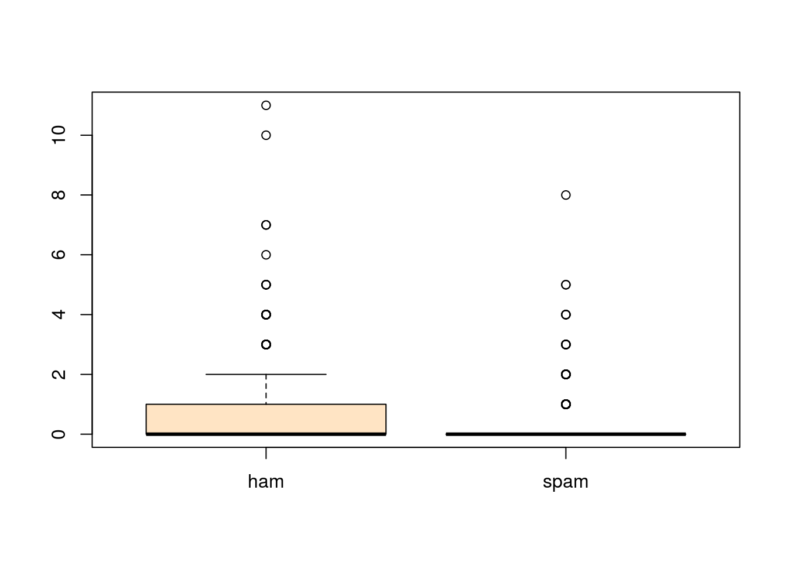

# Sujet Meetup TDS NoBlaBla
Géraud  

## Programme


R est un langage de programmation et outil d'analyse statistique dont la popularité ne cesse
de croître parmi la communauté des data heroes. 
Au cours de cet atelier, nous allons travailler autour du sujet de la détection de spam
et ainsi:

* découvrir les bases du langages R
* apprendre à charger et manipuler des jeux de données
* appliquer des algorithmes de Machine Learning pour la détection de spam
* interpréter et évaluer les modèles générés

### Pré-requis

Vous devez avoir installé les outils suivants:

* R 3.2:
    * [Windows](http://cran.rstudio.com/bin/windows/base/)
    * [MacOS](http://cran.rstudio.com/bin/macosx/)
    * [Linux](http://cran.rstudio.com/bin/linux/)
* RStudio Desktop: http://www.rstudio.com/products/rstudio/download/

Les packages suivants doivent être installés (lancer Rstudio puis menu Tools -> Install packages...):

* rpart
* rpart.plot


Les jeux de données doivent être téléchargés depuis les urls suivantes:

* [Données d'entraînement](https://raw.githubusercontent.com/geraudster/spamdata/master/emails_train.csv)
* [Données de test](https://raw.githubusercontent.com/geraudster/spamdata/master/emails_test.csv)

## Intro R

* R c'est quoi? les origines...
* Présentation RStudio

### R c'est quoi?

**R** est un dialecte de **S**.

S c'est quoi? C'est un environnement pour l'analyse statistique développé en Fortran 
par les laboratoires Bell dès 1976.
Il a été réécrit en C en 1988. 
En 1991, début de l'implémentation de R par l'université d'Aukland, pour pallier au fait que la version de S-PLUS
était propriétaire.

Jusqu'en 2008 S-PLUS devient la propriété de TIBCO.

2015: R en version 3.2

La philosophie de S / R: fournir un environnement interactif pour l'analyse statistique.

### RStudio

[Rstudio](http://www.rstudio.com/) est une société qui publie l'environnement de développement Rstudio (et d'autres services comme ShinyApps, Rpubs...)

Plusieurs versions sont disponibles dont une version *Open Source*.

## Les bases du langage

*A METTRE A JOUR*

R est une grosse calculatrice qui fournit une interface REPL (Read-Eval-Print-Loop).


```r
1 + 2
```

```
## [1] 3
```

```r
log(5)
```

```
## [1] 1.609438
```

```r
sqrt(25)
```

```
## [1] 5
```

À tout moment, il est possible d'accéder à l'aide en ligne:


```r
?log
?sqrt
?`+`
```

### Opérateurs, valeurs, listes, dataframes

Utiliser des scalaires:

```r
1 + 2
```

```
## [1] 3
```

```r
log(5)
```

```
## [1] 1.609438
```

```r
sqrt(25)
```

```
## [1] 5
```

Affecter un résultat à une variable:

```r
resultat <- 1 + 2
resultat
```

```
## [1] 3
```


Manipuler des vecteurs:


```r
c(42,123)
```

```
## [1]  42 123
```

```r
chiffres <- c(1,2,3,4,5,6,7,8,9)
chiffres
```

```
## [1] 1 2 3 4 5 6 7 8 9
```

```r
chiffres <- 1:9
chiffres
```

```
## [1] 1 2 3 4 5 6 7 8 9
```

```r
c('a', 'b', 'c')
```

```
## [1] "a" "b" "c"
```

```r
letters[1:3]
```

```
## [1] "a" "b" "c"
```

Les vecteurs ne contiennent que des données du même type:

```r
c(1,2,'toto')
```

```
## [1] "1"    "2"    "toto"
```


Opérations entre scalaires et vecteurs:

```r
1:9 + 2
```

```
## [1]  3  4  5  6  7  8  9 10 11
```

```r
1:9 * 3
```

```
## [1]  3  6  9 12 15 18 21 24 27
```

Opérations entre vecteurs:

```r
1:9 * 1:9
```

```
## [1]  1  4  9 16 25 36 49 64 81
```

```r
1:9 * 2:4
```

```
## [1]  2  6 12  8 15 24 14 24 36
```

Les listes peuvent contenir des types différents:

```r
list(1,2,'toto')
```

```
## [[1]]
## [1] 1
## 
## [[2]]
## [1] 2
## 
## [[3]]
## [1] "toto"
```

```r
maListe <- list(1,2,'toto')
maListe[2]
```

```
## [[1]]
## [1] 2
```

```r
maListe[[2]]
```

```
## [1] 2
```

Les Data Frames permettent de stocker des tableaux de données:

```r
prenoms <- c('Alice', 'Bob', 'Carole')
sexe <- c('F', 'M', 'F')
ages <- c(24, 30, 23)
monDataFrame <- data.frame(prenoms, sexe, ages)
monDataFrame
```

```
##   prenoms sexe ages
## 1   Alice    F   24
## 2     Bob    M   30
## 3  Carole    F   23
```

```r
monDataFrame[2, 'prenoms']
```

```
## [1] Bob
## Levels: Alice Bob Carole
```

```r
monDataFrame$prenoms
```

```
## [1] Alice  Bob    Carole
## Levels: Alice Bob Carole
```

Aide-mémoire pour les indices des data.frames: [ROW, COL] -> ROW is COol


* Structure de contrôle (if, loop..)


## Cas d'utilisation spam filter

À partir d'un jeu de données contenant une liste de e-mails reconnus comme étant soit
spam soit ham, nous allons entraîné plusieurs modèles afin de pouvoir déterminer automatiquement
la nature d'un e-mail.

Dans le jeu de données, les e-mails sont représentés sous forme de vecteurs contenant les termes les plus présents et leurs occurences.

### Récupération et exploration des données

Récupérer les 2 jeux de données depuis les urls suivantes:

* [Données d'entraînement](https://raw.githubusercontent.com/geraudster/spamdata/master/emails_train.csv)
* [Données de test](https://raw.githubusercontent.com/geraudster/spamdata/master/emails_test.csv)

Chargement des données (par l'IHM) ou directement en R:

```r
trainSet <- read.csv('emails_train.csv')
testSet <- read.csv('emails_test.csv')

dim(trainSet)
```

```
## [1] 4010   31
```

```r
colnames(trainSet)
```

```
##  [1] "enron"    "ect"      "subject"  "vinc"     "will"     "hou"     
##  [7] "com"      "pleas"    "X2000"    "kaminski" "can"      "thank"   
## [13] "forward"  "time"     "X2001"    "research" "market"   "work"    
## [19] "inform"   "price"    "meet"     "know"     "group"    "manag"   
## [25] "may"      "get"      "like"     "use"      "need"     "busi"    
## [31] "spam"
```

```r
str(trainSet)
```

```
## 'data.frame':	4010 obs. of  31 variables:
##  $ enron   : int  0 0 0 0 0 0 0 0 0 0 ...
##  $ ect     : int  0 0 0 0 0 0 0 0 0 0 ...
##  $ subject : int  1 1 1 1 1 1 1 2 1 1 ...
##  $ vinc    : int  0 0 0 0 0 0 0 0 0 0 ...
##  $ will    : int  6 0 0 0 0 1 0 0 0 0 ...
##  $ hou     : int  0 0 0 0 0 0 0 0 0 0 ...
##  $ com     : int  0 0 0 1 0 0 0 1 0 0 ...
##  $ pleas   : int  0 0 0 0 1 0 0 0 0 0 ...
##  $ X2000   : int  0 0 0 0 0 0 0 0 0 0 ...
##  $ kaminski: int  0 0 0 0 0 0 0 0 0 0 ...
##  $ can     : int  0 0 0 0 0 11 1 0 1 1 ...
##  $ thank   : int  0 0 0 0 0 0 0 0 0 0 ...
##  $ forward : int  0 0 0 0 0 4 0 0 0 0 ...
##  $ time    : int  0 0 1 0 0 4 0 0 0 0 ...
##  $ X2001   : int  0 0 0 0 0 0 0 1 0 0 ...
##  $ research: int  0 0 0 0 0 1 0 0 0 0 ...
##  $ market  : int  4 0 0 0 0 0 0 0 0 0 ...
##  $ work    : int  0 0 0 0 0 1 0 0 0 0 ...
##  $ inform  : int  1 0 0 2 0 11 0 0 0 0 ...
##  $ price   : int  0 0 0 0 0 4 0 0 0 0 ...
##  $ meet    : int  0 0 0 0 0 0 0 0 0 0 ...
##  $ know    : int  0 0 0 0 0 1 0 0 0 0 ...
##  $ group   : int  0 1 0 0 0 0 0 0 0 0 ...
##  $ manag   : int  1 0 0 0 0 1 0 0 0 0 ...
##  $ may     : int  0 0 0 0 0 4 0 0 0 0 ...
##  $ get     : int  0 0 0 0 0 0 2 0 2 2 ...
##  $ like    : int  0 3 0 0 0 0 1 0 1 1 ...
##  $ use     : int  1 0 0 0 0 4 0 0 0 0 ...
##  $ need    : int  0 0 0 0 0 3 0 0 0 0 ...
##  $ busi    : int  2 0 0 0 0 3 0 2 0 0 ...
##  $ spam    : int  1 1 1 1 1 1 1 1 1 1 ...
```

```r
#View(spambase) # ou clic sur spambase dans l'onglet Environment

table(trainSet$spam)
```

```
## 
##    0    1 
## 3052  958
```

```r
table(testSet$spam)
```

```
## 
##    0    1 
## 1308  410
```

Gestion du label de spam:

```r
trainSet$spam <- factor(trainSet$spam, levels = c(0,1), labels = c('ham', 'spam'))
str(trainSet$spam)
```

```
##  Factor w/ 2 levels "ham","spam": 2 2 2 2 2 2 2 2 2 2 ...
```

```r
table(trainSet$spam)
```

```
## 
##  ham spam 
## 3052  958
```

On fait pareil pour le jeu de test:

```r
testSet$spam <- factor(testSet$spam, levels = c(0,1), labels = c('ham', 'spam'))
```

### Exploration

Quelques histogrammes:

```r
hist(trainSet$enron)
```

 

```r
hist(trainSet$like)
```

 

```r
hist(trainSet$busi)
```

 


Une boxplot:

```r
boxplot(trainSet$enron ~ trainSet$spam)
```

 

```r
boxplot(trainSet$like ~ trainSet$spam)
```

 

```r
boxplot(trainSet$busi ~ trainSet$spam)
```

 

```r
boxplot(trainSet$pleas ~ trainSet$spam)
```

 

```r
boxplot(trainSet$com ~ trainSet$spam)
```

 


### Modélisation

* Bref rappel des principes de machine learning

*dessin ?*

* Problématique de la classification / présentation de la régression logistique
* Application de l'algo


```r
model.logit <- glm(spam ~ ., trainSet, family = 'binomial')
```

```
## Warning: glm.fit: fitted probabilities numerically 0 or 1 occurred
```

* Interprétation du modèle


```r
summary(model.logit)
```

```
## 
## Call:
## glm(formula = spam ~ ., family = "binomial", data = trainSet)
## 
## Deviance Residuals: 
##    Min      1Q  Median      3Q     Max  
## -4.210   0.000   0.000   0.000   2.803  
## 
## Coefficients:
##               Estimate Std. Error z value Pr(>|z|)    
## (Intercept) -6.034e-01  3.330e-01  -1.812 0.069953 .  
## enron       -2.584e+01  4.524e+02  -0.057 0.954451    
## ect         -5.945e-01  4.035e-01  -1.473 0.140661    
## subject      1.481e+00  3.164e-01   4.682 2.84e-06 ***
## vinc        -2.146e+01  1.182e+03  -0.018 0.985513    
## will        -1.110e-01  5.817e-02  -1.909 0.056326 .  
## hou          5.933e-01  3.837e-01   1.546 0.122061    
## com          3.053e-01  7.448e-02   4.100 4.14e-05 ***
## pleas       -2.950e-01  9.158e-02  -3.222 0.001274 ** 
## X2000       -2.399e+00  3.372e-01  -7.114 1.13e-12 ***
## kaminski    -2.151e+01  1.254e+03  -0.017 0.986311    
## can          1.181e-01  9.483e-02   1.245 0.213012    
## thank       -9.847e-01  1.508e-01  -6.528 6.65e-11 ***
## forward     -7.286e-01  1.795e-01  -4.060 4.91e-05 ***
## time         2.016e-01  1.322e-01   1.525 0.127315    
## X2001       -1.737e+00  3.392e-01  -5.120 3.05e-07 ***
## research    -1.814e+00  2.886e-01  -6.287 3.24e-10 ***
## market      -3.832e-02  1.059e-01  -0.362 0.717471    
## work        -5.483e-02  1.328e-01  -0.413 0.679596    
## inform       4.133e-01  1.151e-01   3.592 0.000328 ***
## price       -3.072e-01  8.174e-02  -3.758 0.000171 ***
## meet        -9.887e-01  2.073e-01  -4.769 1.85e-06 ***
## know         5.868e-02  1.699e-01   0.345 0.729731    
## group       -5.643e-01  1.647e-01  -3.427 0.000610 ***
## manag        5.908e-03  1.319e-01   0.045 0.964268    
## may          3.100e-01  1.181e-01   2.626 0.008652 ** 
## get          6.130e-01  1.431e-01   4.283 1.84e-05 ***
## like         1.822e-01  1.299e-01   1.402 0.160801    
## use          1.558e-01  1.071e-01   1.455 0.145544    
## need        -1.252e-01  1.130e-01  -1.108 0.267815    
## busi         9.660e-01  1.479e-01   6.533 6.46e-11 ***
## ---
## Signif. codes:  0 '***' 0.001 '**' 0.01 '*' 0.05 '.' 0.1 ' ' 1
## 
## (Dispersion parameter for binomial family taken to be 1)
## 
##     Null deviance: 4409.5  on 4009  degrees of freedom
## Residual deviance: 1293.3  on 3979  degrees of freedom
## AIC: 1355.3
## 
## Number of Fisher Scoring iterations: 24
```

* Évaluation du modèle (score, matrice de confusion)


```r
train.predictions <- predict(model.logit, newdata = trainSet, type = 'response')
train.confusionMat <- table(trainSet$spam, train.predictions >= 0.5)
train.confusionMat
```

```
##       
##        FALSE TRUE
##   ham   2838  214
##   spam    55  903
```

```r
sum(diag(train.confusionMat) / nrow(trainSet))
```

```
## [1] 0.9329177
```

```r
test.predictions <- predict(model.logit, newdata = testSet, type = 'response')
test.confusionMat <- table(testSet$spam, test.predictions >= 0.5)
test.confusionMat
```

```
##       
##        FALSE TRUE
##   ham   1204  104
##   spam    26  384
```

```r
sum(diag(test.confusionMat) / nrow(testSet))
```

```
## [1] 0.9243306
```

* Modification du seuil

Avec une valeur de seuil plus pessimiste:

```r
train.confusionMat <- table(trainSet$spam, train.predictions >= 0.8)
train.confusionMat
```

```
##       
##        FALSE TRUE
##   ham   3013   39
##   spam   517  441
```

```r
sum(diag(train.confusionMat) / nrow(trainSet))
```

```
## [1] 0.8613466
```

Avec une valeur de seuil plus optimiste:

```r
train.confusionMat <- table(trainSet$spam, train.predictions >= 0.2)
train.confusionMat
```

```
##       
##        FALSE TRUE
##   ham   2716  336
##   spam    17  941
```

```r
sum(diag(train.confusionMat) / nrow(trainSet))
```

```
## [1] 0.9119701
```

### Création d'un arbre de décision

Installation des packages par RStudio ou directement en R:

```r
#install.packages('rpart')
#install.packages('rpart.plot')
```


```r
library(rpart)
library(rpart.plot)
```

Création du modèle:

```r
model.rpart <- rpart(spam ~ ., trainSet)
summary(model.rpart)
```

```
## Call:
## rpart(formula = spam ~ ., data = trainSet)
##   n= 4010 
## 
##           CP nsplit rel error    xerror       xstd
## 1 0.18841336      0 1.0000000 1.0000000 0.02818625
## 2 0.10647182      2 0.6231733 0.6231733 0.02352977
## 3 0.08037578      3 0.5167015 0.5448852 0.02224261
## 4 0.03549061      4 0.4363257 0.4540710 0.02055630
## 5 0.03131524      5 0.4008351 0.4050104 0.01954125
## 6 0.02609603      6 0.3695198 0.3945720 0.01931440
## 7 0.01565762      7 0.3434238 0.3528184 0.01836420
## 8 0.01252610      8 0.3277662 0.3371608 0.01798871
## 9 0.01000000      9 0.3152401 0.3277662 0.01775796
## 
## Variable importance
##    enron     vinc kaminski      ect      hou  subject    X2000    thank 
##       21       20       12       11       10       10        4        3 
##    X2001 research      com     busi    manag     meet 
##        2        2        1        1        1        1 
## 
## Node number 1: 4010 observations,    complexity param=0.1884134
##   predicted class=ham   expected loss=0.2389027  P(node) =1
##     class counts:  3052   958
##    probabilities: 0.761 0.239 
##   left son=2 (1973 obs) right son=3 (2037 obs)
##   Primary splits:
##       vinc     < 0.5  to the right, improve=443.3561, (0 missing)
##       enron    < 0.5  to the right, improve=380.0204, (0 missing)
##       kaminski < 0.5  to the right, improve=245.2604, (0 missing)
##       thank    < 0.5  to the right, improve=205.1228, (0 missing)
##       X2000    < 0.5  to the right, improve=176.8040, (0 missing)
##   Surrogate splits:
##       kaminski < 0.5  to the right, agree=0.809, adj=0.612, (0 split)
##       subject  < 1.5  to the right, agree=0.754, adj=0.499, (0 split)
##       enron    < 0.5  to the right, agree=0.721, adj=0.433, (0 split)
##       ect      < 0.5  to the right, agree=0.713, adj=0.416, (0 split)
##       hou      < 0.5  to the right, agree=0.710, adj=0.411, (0 split)
## 
## Node number 2: 1973 observations
##   predicted class=ham   expected loss=0  P(node) =0.49202
##     class counts:  1973     0
##    probabilities: 1.000 0.000 
## 
## Node number 3: 2037 observations,    complexity param=0.1884134
##   predicted class=ham   expected loss=0.4702995  P(node) =0.50798
##     class counts:  1079   958
##    probabilities: 0.530 0.470 
##   left son=6 (482 obs) right son=7 (1555 obs)
##   Primary splits:
##       enron    < 0.5  to the right, improve=279.31010, (0 missing)
##       X2000    < 0.5  to the right, improve=116.93770, (0 missing)
##       thank    < 0.5  to the right, improve=116.70830, (0 missing)
##       pleas    < 0.5  to the right, improve= 93.12507, (0 missing)
##       research < 0.5  to the right, improve= 76.64549, (0 missing)
##   Surrogate splits:
##       ect   < 0.5  to the right, agree=0.811, adj=0.203, (0 split)
##       hou   < 0.5  to the right, agree=0.804, adj=0.172, (0 split)
##       X2000 < 1.5  to the right, agree=0.781, adj=0.075, (0 split)
##       X2001 < 1.5  to the right, agree=0.781, adj=0.075, (0 split)
##       manag < 1.5  to the right, agree=0.779, adj=0.066, (0 split)
## 
## Node number 6: 482 observations
##   predicted class=ham   expected loss=0  P(node) =0.1201995
##     class counts:   482     0
##    probabilities: 1.000 0.000 
## 
## Node number 7: 1555 observations,    complexity param=0.1064718
##   predicted class=spam  expected loss=0.3839228  P(node) =0.3877805
##     class counts:   597   958
##    probabilities: 0.384 0.616 
##   left son=14 (142 obs) right son=15 (1413 obs)
##   Primary splits:
##       X2000    < 0.5  to the right, improve=70.58592, (0 missing)
##       thank    < 0.5  to the right, improve=67.40011, (0 missing)
##       research < 0.5  to the right, improve=62.27685, (0 missing)
##       pleas    < 0.5  to the right, improve=39.43205, (0 missing)
##       X2001    < 0.5  to the right, improve=37.13951, (0 missing)
##   Surrogate splits:
##       ect    < 2.5  to the right, agree=0.915, adj=0.070, (0 split)
##       hou    < 1.5  to the right, agree=0.914, adj=0.063, (0 split)
##       use    < 5.5  to the right, agree=0.911, adj=0.028, (0 split)
##       market < 13   to the right, agree=0.911, adj=0.021, (0 split)
##       X2001  < 12   to the right, agree=0.910, adj=0.014, (0 split)
## 
## Node number 14: 142 observations
##   predicted class=ham   expected loss=0.1408451  P(node) =0.03541147
##     class counts:   122    20
##    probabilities: 0.859 0.141 
## 
## Node number 15: 1413 observations,    complexity param=0.08037578
##   predicted class=spam  expected loss=0.3361642  P(node) =0.3523691
##     class counts:   475   938
##    probabilities: 0.336 0.664 
##   left son=30 (247 obs) right son=31 (1166 obs)
##   Primary splits:
##       thank    < 0.5  to the right, improve=61.18893, (0 missing)
##       research < 0.5  to the right, improve=49.61791, (0 missing)
##       X2001    < 0.5  to the right, improve=34.95400, (0 missing)
##       kaminski < 0.5  to the right, improve=29.78025, (0 missing)
##       busi     < 1.5  to the left,  improve=26.22523, (0 missing)
##   Surrogate splits:
##       work     < 6.5  to the right, agree=0.829, adj=0.020, (0 split)
##       get      < 6.5  to the right, agree=0.827, adj=0.012, (0 split)
##       time     < 11   to the right, agree=0.827, adj=0.008, (0 split)
##       kaminski < 0.5  to the right, agree=0.826, adj=0.004, (0 split)
##       know     < 2.5  to the right, agree=0.826, adj=0.004, (0 split)
## 
## Node number 30: 247 observations,    complexity param=0.03131524
##   predicted class=ham   expected loss=0.3441296  P(node) =0.06159601
##     class counts:   162    85
##    probabilities: 0.656 0.344 
##   left son=60 (181 obs) right son=61 (66 obs)
##   Primary splits:
##       com    < 0.5  to the left,  improve=26.443230, (0 missing)
##       use    < 0.5  to the left,  improve=17.429930, (0 missing)
##       may    < 0.5  to the left,  improve=13.438170, (0 missing)
##       inform < 1.5  to the left,  improve= 7.875515, (0 missing)
##       will   < 3.5  to the left,  improve= 7.169782, (0 missing)
##   Surrogate splits:
##       work  < 2.5  to the left,  agree=0.753, adj=0.076, (0 split)
##       get   < 3.5  to the left,  agree=0.753, adj=0.076, (0 split)
##       will  < 3.5  to the left,  agree=0.749, adj=0.061, (0 split)
##       pleas < 3.5  to the left,  agree=0.749, adj=0.061, (0 split)
##       can   < 3.5  to the left,  agree=0.745, adj=0.045, (0 split)
## 
## Node number 31: 1166 observations,    complexity param=0.03549061
##   predicted class=spam  expected loss=0.2684391  P(node) =0.2907731
##     class counts:   313   853
##    probabilities: 0.268 0.732 
##   left son=62 (84 obs) right son=63 (1082 obs)
##   Primary splits:
##       research < 0.5  to the right, improve=34.09131, (0 missing)
##       X2001    < 0.5  to the right, improve=32.61994, (0 missing)
##       meet     < 1.5  to the right, improve=24.56416, (0 missing)
##       kaminski < 0.5  to the right, improve=17.36407, (0 missing)
##       busi     < 1.5  to the left,  improve=17.25223, (0 missing)
##   Surrogate splits:
##       may     < 3.5  to the right, agree=0.935, adj=0.095, (0 split)
##       can     < 9.5  to the right, agree=0.933, adj=0.071, (0 split)
##       forward < 3.5  to the right, agree=0.932, adj=0.060, (0 split)
##       inform  < 10.5 to the right, agree=0.932, adj=0.060, (0 split)
##       busi    < 9.5  to the right, agree=0.931, adj=0.048, (0 split)
## 
## Node number 60: 181 observations
##   predicted class=ham   expected loss=0.2044199  P(node) =0.04513716
##     class counts:   144    37
##    probabilities: 0.796 0.204 
## 
## Node number 61: 66 observations
##   predicted class=spam  expected loss=0.2727273  P(node) =0.01645885
##     class counts:    18    48
##    probabilities: 0.273 0.727 
## 
## Node number 62: 84 observations,    complexity param=0.01565762
##   predicted class=ham   expected loss=0.297619  P(node) =0.02094763
##     class counts:    59    25
##    probabilities: 0.702 0.298 
##   left son=124 (69 obs) right son=125 (15 obs)
##   Primary splits:
##       busi    < 1.5  to the left,  improve=18.01760, (0 missing)
##       inform  < 3.5  to the left,  improve=17.50933, (0 missing)
##       may     < 2.5  to the left,  improve=14.57471, (0 missing)
##       time    < 1.5  to the left,  improve=14.55872, (0 missing)
##       forward < 2.5  to the left,  improve=10.73016, (0 missing)
##   Surrogate splits:
##       time    < 1.5  to the left,  agree=0.905, adj=0.467, (0 split)
##       inform  < 3.5  to the left,  agree=0.905, adj=0.467, (0 split)
##       get     < 1.5  to the left,  agree=0.905, adj=0.467, (0 split)
##       can     < 8.5  to the left,  agree=0.893, adj=0.400, (0 split)
##       forward < 2.5  to the left,  agree=0.893, adj=0.400, (0 split)
## 
## Node number 63: 1082 observations,    complexity param=0.02609603
##   predicted class=spam  expected loss=0.2347505  P(node) =0.2698254
##     class counts:   254   828
##    probabilities: 0.235 0.765 
##   left son=126 (37 obs) right son=127 (1045 obs)
##   Primary splits:
##       X2001    < 0.5  to the right, improve=27.86783, (0 missing)
##       meet     < 0.5  to the right, improve=17.91559, (0 missing)
##       forward  < 0.5  to the right, improve=15.03595, (0 missing)
##       kaminski < 0.5  to the right, improve=13.01567, (0 missing)
##       busi     < 1.5  to the left,  improve=10.64234, (0 missing)
##   Surrogate splits:
##       meet < 3.5  to the right, agree=0.969, adj=0.081, (0 split)
##       hou  < 0.5  to the right, agree=0.967, adj=0.027, (0 split)
## 
## Node number 124: 69 observations
##   predicted class=ham   expected loss=0.1449275  P(node) =0.01720698
##     class counts:    59    10
##    probabilities: 0.855 0.145 
## 
## Node number 125: 15 observations
##   predicted class=spam  expected loss=0  P(node) =0.003740648
##     class counts:     0    15
##    probabilities: 0.000 1.000 
## 
## Node number 126: 37 observations
##   predicted class=ham   expected loss=0.1621622  P(node) =0.009226933
##     class counts:    31     6
##    probabilities: 0.838 0.162 
## 
## Node number 127: 1045 observations,    complexity param=0.0125261
##   predicted class=spam  expected loss=0.2133971  P(node) =0.2605985
##     class counts:   223   822
##    probabilities: 0.213 0.787 
##   left son=254 (18 obs) right son=255 (1027 obs)
##   Primary splits:
##       meet     < 1.5  to the right, improve=14.078040, (0 missing)
##       kaminski < 0.5  to the right, improve=12.494450, (0 missing)
##       busi     < 1.5  to the left,  improve=10.299620, (0 missing)
##       com      < 0.5  to the left,  improve= 9.508968, (0 missing)
##       forward  < 0.5  to the right, improve= 8.911035, (0 missing)
## 
## Node number 254: 18 observations
##   predicted class=ham   expected loss=0.1666667  P(node) =0.004488778
##     class counts:    15     3
##    probabilities: 0.833 0.167 
## 
## Node number 255: 1027 observations
##   predicted class=spam  expected loss=0.2025316  P(node) =0.2561097
##     class counts:   208   819
##    probabilities: 0.203 0.797
```

Interprétation:

```r
prp(model.rpart)
```

 

```r
#prp(model.rpart, extra = 1)
```

Prédiction sur les données du trainSet:

```r
train.predictions2 <- predict(model.rpart, newdata = trainSet)
train.confusionMat2 <- table(trainSet$spam, train.predictions2[,'spam'] >= 0.5)
train.confusionMat2
```

```
##       
##        FALSE TRUE
##   ham   2826  226
##   spam    76  882
```

```r
sum(diag(train.confusionMat2) / nrow(trainSet))
```

```
## [1] 0.9246883
```

Avec une valeur de seuil plus pessimiste:

```r
train.confusionMat2 <- table(trainSet$spam, train.predictions2[,'spam'] >= 0.8)
train.confusionMat2
```

```
##       
##        FALSE TRUE
##   ham   3052    0
##   spam   943   15
```

```r
sum(diag(train.confusionMat2) / nrow(trainSet))
```

```
## [1] 0.7648379
```

Avec une valeur de seuil plus optimiste:

```r
train.confusionMat2 <- table(trainSet$spam, train.predictions2[,'spam'] >= 0.2)
train.confusionMat2
```

```
##       
##        FALSE TRUE
##   ham   2682  370
##   spam    39  919
```

```r
sum(diag(train.confusionMat2) / nrow(trainSet))
```

```
## [1] 0.898005
```


Validation du modèle:

```r
test.predictions2 <- predict(model.rpart, newdata = testSet)
test.confusionMat2 <- table(testSet$spam, test.predictions2[,'spam'] >= 0.5)
test.confusionMat2
```

```
##       
##        FALSE TRUE
##   ham   1197  111
##   spam    40  370
```

```r
sum(diag(test.confusionMat2) / nrow(testSet))
```

```
## [1] 0.9121071
```

## Pour aller plus loin - les courbes de ROC

Dessinons la courbe ROC pour le modèle de régression logistique: 

```r
library(ggplot2)
library(ROCR)
```

```
## Loading required package: gplots
## 
## Attaching package: 'gplots'
## 
## The following object is masked from 'package:stats':
## 
##     lowess
```

```r
predictions.logit <- prediction(test.predictions, testSet$spam)
perf.logit <- performance(predictions.logit, measure = 'tpr', x.measure = 'fpr')
roc.data <- data.frame(fpr=unlist(perf.logit@x.values),
                       tpr=unlist(perf.logit@y.values),
                       model="GLM")
ggplot(roc.data, aes(x=fpr, ymin=0, ymax=tpr)) +
    geom_ribbon(alpha=0.2) +
    geom_line(aes(y=tpr)) +
    ggtitle('Courbe ROC pour le modèle de régression logistique')
```

 

Maintenant pour le modèle de l'arbre de décision:


```r
predictions.rpart <- prediction(test.predictions2[,'spam'], testSet$spam)
perf.rpart <- performance(predictions.rpart, measure = 'tpr', x.measure = 'fpr')
roc.data <- data.frame(fpr=unlist(perf.rpart@x.values),
                       tpr=unlist(perf.rpart@y.values),
                       model="GLM")
ggplot(roc.data, aes(x=fpr, ymin=0, ymax=tpr)) +
    geom_ribbon(alpha=0.2) +
    geom_line(aes(y=tpr)) +
    ggtitle('Courbe ROC pour le modèle d\'arbre de décision')
```

 

## Bibliographie

* http://www.cs.cmu.edu/~eugene/research/full/detect-scam.pdf
* http://cran.r-project.org/web/views/MachineLearning.html
* http://kooperberg.fhcrc.org/logic/documents/ingophd-logic.pdf
* Lichman, M. (2013). UCI Machine Learning Repository [http://archive.ics.uci.edu/ml]. Irvine, CA: University of California, School of Information and Computer Science. 
* Liste des modèles supportés par le package *caret*: http://topepo.github.io/caret/modelList.html

